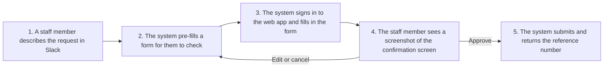
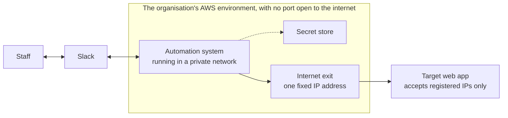

# Web Automation from Slack: Executive Overview

This document is for decision makers. The technical detail the engineering team needs to build the system is in [02-solution-architecture.md](02-solution-architecture.md).

## 1. Summary

Staff currently sign in to a web application and fill in forms by hand for work that repeats every day. That web application has no API, and it only accepts connections from IP addresses registered in advance.

The proposed solution lets staff make the request in Slack with one sentence. The system signs in and fills in the form for them, stops at the confirmation screen, and submits only when the person who asked approves it.

A trial version ran on AWS on 2026-10-05 against a simulated website. The full flow worked, from the Slack request to the reference number coming back. Three parts have not been run for real: the route to the internet through a fixed IP address, the connection to the real web application, and the use of AWS's own AI service in place of an outside one. The trial environment has since been removed, so it is no longer costing anything.

Infrastructure cost is estimated at about 82 USD a month.

**Decision needed from leadership:** approval to run the next stage against the real web application. This includes asking the web application's owner for a dedicated account for the system and for one IP address to be registered.

## 2. The problem

- A group of staff repeat the same steps on the web application many times a day: sign in, fill in a multi-step form, check it, submit.
- The web application offers no API, so the usual system-to-system connection is not possible.
- The web application restricts access by IP address. Any automated system that uses it must reach the internet from one fixed, registered address.
- Submitting the form cannot be undone. An automated system that submits the wrong thing creates a wrong record in someone else's web application.

## 3. The solution

Staff never leave Slack, and nothing is submitted without a person deciding to submit it.

The design makes four commitments:

| Commitment | What it means for the organisation |
|---|---|
| A person approves the last step | The system never submits on its own. The requester sees the exact screen that will be submitted before approving |
| AI only suggests | AI reads the sentence and pre-fills the form. What reaches the web application is always what the staff member reviewed and confirmed |
| Passwords never pass through Slack | The web application account is held in AWS's secret store. Neither staff nor the system logs can see it |
| Errors are reported clearly | When the web application rejects a request, the staff member receives its reason word for word in Slack |

## 4. Proposed architecture

In plain terms:

- **The system runs in a private network** on AWS. Nothing on the internet can connect in; the system only connects out.
- **Every outgoing connection leaves through a single exit** that carries one fixed IP address. The organisation gives this address to the web application's owner to register once.
- **There are no servers to manage.** AWS provides the machines, patches the operating system and restarts the system after a failure.

## 5. What has been verified

The trial ran on AWS on 2026-10-05, with 5 real requests sent from Slack to a simulated website that has a three-step form.

| Question | Result |
|---|---|
| Does the system run on AWS? | Yes. It started in about 40 seconds and ran steadily, with no unplanned stops |
| How long does a staff member wait? | About 3 seconds from sending the form to receiving the confirmation screenshot in Slack |
| Was anything submitted without approval? | No. The two approved requests received reference numbers; the two cancelled requests submitted nothing |
| What happens when the web application rejects a request? | The staff member received the web application's own error message |
| Did passwords leak into the logs? | No access keys were found in the logs |
| Does it use much capacity? | Peak use was about 10% of the memory allocated |
| Can the environment be removed cleanly? | Yes. Everything created for the trial was deleted the same day |

Not yet verified, and part of the next stage:

- **The fixed IP address.** The trial ran on a public network to keep cost down. The private network with a fixed exit is a standard AWS pattern and is written up as a step-by-step guide, but it has not been run.
- **The real web application.** Only the simulated website has been tested. The real one needs its own form-filling logic written to match its screens.
- **AI on AWS.** The trial used an outside AI service (OpenRouter) because it was quick to set up. The proposal is Amazon Bedrock, but AWS has not yet enabled that service on the trial account, so its quality could not be measured. This needs a request to AWS Support, or the organisation's own AWS account.
- **Several people using it at once**, and recovery after the system stops unexpectedly.

## 6. Why these services

| Need | Choice | Why | Alternative | Why not |
|---|---|---|---|---|
| Where the system runs | ECS Fargate | No servers to patch or watch. It runs continuously, which suits holding a connection to Slack and keeping a browser open while waiting for approval | Virtual servers (EC2) | Slightly cheaper, but the organisation has to patch and monitor the machines itself |
| | | | Lambda | Runs only in short bursts. It cannot hold a continuous connection to Slack and does not suit waiting several minutes for approval |
| | | | Kubernetes (EKS) | Built for large systems with many services; too heavy for one small application |
| Fixed IP address | Private network with a NAT Gateway | One address that does not change, run by AWS, unaffected by the system restarting | Public IP attached directly to the system | The address changes on every restart, so it cannot be registered with the web application's owner |
| | | | Virtual server with a fixed IP | Cheaper, but brings back server management |
| | | | Third-party proxy service | All data and passwords would pass through a party outside the organisation |
| | | | Private link to the web application (VPN) | The most secure option, but the web application's owner has to build it too. Worth considering if the relationship is close enough |
| Connection to Slack | The system calls out to Slack | No port has to be opened to the internet, so there is nothing to attack from outside | Slack calls in to a public address | A public entry point would have to be built and defended |
| Holding passwords | Secrets Manager | Passwords are encrypted, access is logged, and they can be changed without changing the software | Writing them into configuration | Anyone who can read the configuration can read the passwords |
| AI that reads the request | Amazon Bedrock, with a small model that runs in the same region (Amazon Nova Lite proposed as the starting point) | The content of requests stays inside AWS. No extra supplier, contract or access key to manage. The cost appears on the same AWS bill | Stay with OpenRouter, as in the trial | Quick to set up, but data passes through a third party outside the organisation |
| | | | A stronger model on Bedrock (Claude Haiku) | More accurate on ambiguous requests, at a higher price. Held in reserve in case the small model falls short |
| | | | Running a model ourselves (SageMaker) | Paid by the hour even with no requests; far too heavy for reading one short sentence |
| Logs | CloudWatch Logs | Already there, nothing extra to build, and the retention period can be set | An outside monitoring tool | Extra cost and another supplier; worth it only if the organisation already uses one |

Other ways to approach the problem itself:

| Option | Why not |
|---|---|
| Ask the web application's owner for an API | The best answer where it exists. This solution is for when it does not |
| Buy a commercial RPA tool | Strong for processes on personal computers. For one web task it adds licence fees and a platform to run |
| Let AI drive the browser on its own | Flexible, but slow, costly, and not guaranteed to do the same thing every time. For a structured, repeated task a fixed script is more dependable |

## 7. Cost

Estimated at AWS list prices in the Sydney region, running all month:

| Item | USD per month |
|---|---|
| Internet exit with a fixed IP (NAT Gateway) | about 43 |
| Where the system runs (Fargate) | about 35 |
| The fixed IP address | about 4 |
| Secret store, storage, logs | under 1 |
| **Total** | **about 82** |

- More than half the cost is the price of the fixed IP address. Without that requirement, the trial ran at about 39 USD a month.
- Prices differ by region. The figure excludes Slack fees and engineering time.
- AI is charged per request and the amount is very small: with the proposed Bedrock model, an estimated 0.1 USD per thousand requests. AI can also be switched off entirely.
- At this scale the cost barely changes with the number of requests.

## 8. Risks and limits

| Risk | Impact | How it is handled |
|---|---|---|
| The web application changes its screens | The system stops filling in the form until an engineer updates it | The system always reads the confirmation screen back, so a changed screen produces a clear error and not a wrong submission. Someone must own the maintenance |
| The web application asks for a CAPTCHA or a one-time code | The system stops and reports that a person is needed | Agree with the web application's owner on a dedicated account that skips these steps |
| The web application's terms forbid automated access | Legal risk and a locked account | Get written approval before running against the real web application |
| The system restarts mid-request | Requests waiting for approval are lost and have to be sent again. Nothing is submitted wrongly | Accepted for the trial; the production version needs durable state |
| Personal data in screenshots and request text | Compliance responsibility | Rules are needed for where it is stored, how long it is kept and who may see it |
| The request text is sent to an AI provider | In the trial, data goes to a third party | Move to Amazon Bedrock so the data stays inside AWS. AI can also be switched off; the system still works and staff fill in the form themselves |

## 9. Next steps

1. **Leadership decision:** agree to run against the real web application, and name who is responsible for operating it.
2. **Work with the web application's owner:** obtain approval for automated access, a dedicated account for the system, and registration of the IP address.
3. **Engineering team:** build the private network with a fixed IP following [02-solution-architecture.md](02-solution-architecture.md), confirm the outgoing address, write the form-filling logic for the real web application, and move the AI component to Amazon Bedrock.
4. **Pilot with a small group** before widening use, and add what a production version needs: a list of permitted users, an audit record, and alerts when errors rise.
