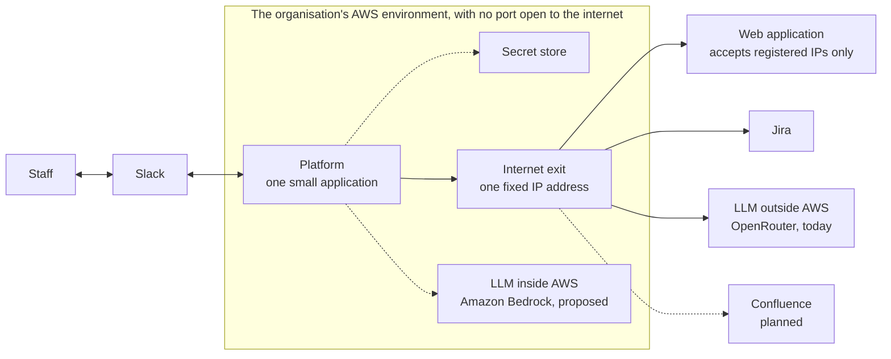

# Slack Automation Platform: Overview

This document is for decision makers. It describes one platform and the proofs of concept (POCs) built on it. The engineering detail is in [02-platform-architecture.md](02-platform-architecture.md) and [03-aws-deployment.md](03-aws-deployment.md); each POC has its own document under [poc/](poc/).

## 1. Summary

Staff already work in Slack. Much of what they do there ends in a routine step somewhere else: filling in a form on a web application, or reading through a day of messages and a task board to write a status report.

The platform is one small system, running in the organisation's AWS environment, that connects Slack to those other places and uses an AI language model (LLM) for the reading and writing in between. Each use case is a POC that reuses the same connections.

Two POCs have been built:

| POC | What it does | Status |
|---|---|---|
| [Web form automation](poc/01-web-form-automation.md) | A staff member asks in Slack with one sentence. The system signs in to a web application that has no API, fills in the form, and submits only after that person approves the confirmation screen | Ran on AWS on 2026-10-05 against a simulated website |
| [Daily report](poc/02-daily-report.md) | The system reads the day's messages in the project's Slack channels and the project's Jira issues, writes the daily report, and points out where the chat and Jira disagree | Ran from a laptop on 2026-10-06 against a real Slack workspace and a real Jira site. Not yet deployed to AWS |

Infrastructure cost is estimated at about 82 USD a month for both POCs together, of which about 47 USD exists only because the web application in the first POC requires a fixed IP address.

**Decisions needed from leadership:**

1. Approval to run the web form automation against the real web application. This includes asking its owner for a dedicated account and for one IP address to be registered.
2. Approval to pilot the daily report on one real project, and a decision on whether project chat may be sent to an AI provider outside AWS for that pilot (section 6).
3. An owner for the open AWS Support request that blocks the use of AWS's own AI service.

## 2. The building blocks

Every POC is assembled from the same five blocks. A new use case adds its own logic and reuses the rest.

| Block | Role in the platform | Today | Planned or open |
|---|---|---|---|
| Slack | Where staff ask, approve and read results | One Slack app that connects out to Slack; nothing is exposed to the internet | A list of who may use each command |
| LLM | Reads free text and writes summaries. It never takes an action | An outside provider, OpenRouter | Amazon Bedrock, inside AWS. Blocked at account level on both AWS accounts tried |
| Jira | The record of tasks, owners and due dates | Read-only, with one query per report | Writing back, for example a comment on an issue the report flags |
| Web applications without an API | Systems that can only be used through their screens | A browser driven by a fixed script | One script per web application |
| AWS | Where the system runs, where secrets are kept, and the fixed IP address | Container service, secret store, logs | Private network with a fixed exit; durable state |
| Confluence | Project documentation | **Not built** | Publishing reports as pages; reading project pages as context for the LLM |

In plain terms:

- **The system runs in a private network** on AWS. Nothing on the internet can connect in; the system only connects out.
- **Every outgoing connection leaves through a single exit** that carries one fixed IP address. Only the web application in the first POC needs this; Slack, Jira and the LLM do not check where a connection comes from.
- **There are no servers to manage.** AWS provides the machines, patches the operating system and restarts the system after a failure.
- **The LLM can sit outside or inside AWS.** The choice changes where the organisation's text travels, and is one place in the software.

## 3. Commitments every POC keeps

| Commitment | What it means for the organisation |
|---|---|
| A person decides what cannot be undone | The system never submits a form on its own. The requester sees the exact screen that will be submitted before approving |
| The LLM only suggests and writes | It pre-fills a form for a person to check, or writes a report marked as written by an LLM. Its output never triggers an action |
| Text from outside is data, not instructions | A sentence in a chat message or a Jira issue cannot tell the system what to do. This was tested with an issue whose title was an instruction; the report listed it as an overdue issue |
| The system sees only what it is given | The Slack app reads only the channels it has been invited to, and reads Jira with one account's permissions |
| Results go to a fixed place | A report is posted to one channel set by an administrator, never to whoever asked for it, so asking cannot be used to read channels a person is not in |
| Passwords never pass through Slack | Accounts and access keys are held in AWS's secret store. Neither staff nor the system logs can see them |

## 4. What has been verified

**Web form automation**, on AWS, 2026-10-05, 5 real requests from Slack to a simulated website:

| Question | Result |
|---|---|
| Does the system run on AWS? | Yes. It started in about 40 seconds and ran steadily |
| How long does a staff member wait? | About 3 seconds from sending the form to receiving the confirmation screenshot |
| Was anything submitted without approval? | No. Approved requests received reference numbers; cancelled requests submitted nothing |
| Can the environment be removed cleanly? | Yes. Everything created for the trial was deleted the same day |

**Daily report**, from a laptop, 2026-10-06, on 25 chat messages in a real Slack channel and 37 issues in a real Jira project, both filled with invented test data:

| Question | Result |
|---|---|
| Does it read a real channel, including replies in threads? | Yes |
| Does it read real Jira issues? | Yes |
| Does it notice where chat and Jira disagree? | Mostly. It caught work reported as finished but still open in Jira, a due date that differs between chat and Jira, a task marked done in Jira that chat says has not started, overdue tasks nobody mentioned, and tasks due soon that nobody mentioned |
| What did it miss? | Three of the eleven prepared cases: work under way in chat but not started in Jira, a task finished without a word in chat, and work in progress with no owner. The instructions to the LLM do not yet ask for these |
| Did it flag things that are fine? | No. The two control cases were left alone |

Not yet verified:

- **The fixed IP address** and **the real web application**, for the first POC.
- **The daily report on AWS**, its command in Slack, and its daily schedule. The report was produced by running it by hand.
- **Real project data.** The chat and the issues were written for the test. Quality on a real, messier project is unknown.
- **AI on AWS.** Amazon Bedrock refused every test call on the two AWS accounts tried, including after one was upgraded to a paid plan. AWS states this needs a request to AWS Support.
- **Several people using it at once**, and recovery after the system stops unexpectedly.

## 5. Why these services

| Need | Choice | Why | Alternative | Why not |
|---|---|---|---|---|
| Where the system runs | ECS Fargate | No servers to patch or watch. It runs continuously, which suits holding a connection to Slack and keeping a browser open while waiting for approval | Virtual servers (EC2) | Slightly cheaper, but the organisation has to patch and monitor the machines itself |
| | | | Lambda | Runs only in short bursts. It cannot hold a continuous connection to Slack and does not suit waiting several minutes for approval |
| | | | Kubernetes (EKS) | Built for large systems with many services; too heavy for one small application |
| Fixed IP address | Private network with a NAT Gateway | One address that does not change, run by AWS, unaffected by the system restarting | Public IP attached directly to the system | The address changes on every restart, so it cannot be registered with the web application's owner |
| | | | Virtual server with a fixed IP | Cheaper, but brings back server management |
| | | | Third-party proxy service | All data and passwords would pass through a party outside the organisation |
| | | | Private link to the web application (VPN) | The most secure option, but the web application's owner has to build it too |
| Connection to Slack | The system calls out to Slack | No port has to be opened to the internet, so there is nothing to attack from outside | Slack calls in to a public address | A public entry point would have to be built and defended |
| Holding passwords | Secrets Manager | Passwords are encrypted, access is logged, and they can be changed without changing the software | Writing them into configuration | Anyone who can read the configuration can read the passwords |
| LLM | Amazon Bedrock, with a model that runs in the same region | The organisation's text stays inside AWS. No extra supplier, contract or access key. The cost appears on the same AWS bill | Stay with OpenRouter, as in the trials | Quick to set up, but requests, chat and task lists pass through a third party |
| | | | Running a model ourselves (SageMaker) | Paid by the hour even with no requests; far too heavy for this volume |
| Reading Jira | A direct call to Jira's own interface | The report needs one fixed query. One request, nothing extra to run | A Jira tool server (MCP) or command-line tool | These suit an AI agent that chooses its own steps. For one fixed query they add a second program to run and keep up to date |
| Logs | CloudWatch Logs | Already there, nothing extra to build, and the retention period can be set | An outside monitoring tool | Extra cost and another supplier |

## 6. Where the organisation's text goes

The two POCs send different amounts of text to the LLM, and that changes how much the choice of provider matters.

| POC | What the LLM receives | Can the LLM be switched off? |
|---|---|---|
| Web form automation | One sentence describing one request | Yes. Staff then fill in the form themselves |
| Daily report | A full day of project chat and the project's task list | No. Writing the report is the LLM's job |

With the outside provider used in the trials, a full day of project conversation leaves the organisation every day. This is acceptable for invented test data. For a real project it needs either a decision that it is acceptable, or Amazon Bedrock, which is still blocked.

## 7. Cost

Estimated at AWS list prices in the Sydney region, running all month:

| Item | USD per month | Needed by |
|---|---|---|
| Internet exit with a fixed IP (NAT Gateway) | about 43 | Web form automation only |
| The fixed IP address | about 4 | Web form automation only |
| Where the system runs (Fargate) | about 35 | Both |
| Secret store, storage, logs | under 1 | Both |
| **Total** | **about 82** | |

- The daily report adds no AWS resource: it runs in the same application. On its own, without the fixed IP address, the platform would cost about 35 USD a month.
- LLM use is charged per request. For the web form it is an estimated 0.1 USD per thousand requests with the proposed Bedrock model. For the daily report the cost per report has not been measured; it is one request a day per project, larger than a form request.
- Prices differ by region. The figures exclude Slack and Jira fees and engineering time.

## 8. Risks and limits

Risks shared by every POC:

| Risk | Impact | How it is handled |
|---|---|---|
| Text is sent to an AI provider outside the organisation | Requests, and for the daily report a full day of chat and tasks, reach a third party | Move to Amazon Bedrock. Until then, limit pilots to data the organisation is willing to send |
| The LLM gets something wrong | A wrongly pre-filled field, or a report that misstates progress | A person checks the form before anything is submitted. Every report says it was written by an LLM. Facts that need counting or dates, such as "overdue", are worked out by the software, not the LLM |
| The system restarts | Requests waiting for approval are lost; a report scheduled for that moment is not posted | Accepted for the trials; the production version needs durable state and a schedule outside the application |
| One access key reads more than intended | The Jira key carries all permissions of the account it belongs to | Use a dedicated account that can only read the projects in the report |
| Personal and project data in logs, screenshots and reports | Compliance responsibility | Rules are needed for where it is stored, how long it is kept and who may see it |

Risks specific to one POC, such as a web application changing its screens, are in that POC's document.

## 9. Next steps

1. **Leadership decisions:** the three in section 1, and a named owner for operating the platform.
2. **AWS:** open the support request for Amazon Bedrock; build the private network with a fixed IP following [03-aws-deployment.md](03-aws-deployment.md).
3. **Web form automation:** obtain the web application owner's approval, a dedicated account and the IP registration; write the form-filling logic for the real web application.
4. **Daily report:** extend the instructions to cover the three missed cases, deploy it to AWS, and pilot it on one real project with the project lead checking each report against their own.
5. **Before wider use:** a list of permitted users, an audit record, and alerts when errors rise.
6. **Next block:** Confluence, once a use case is chosen for it.
