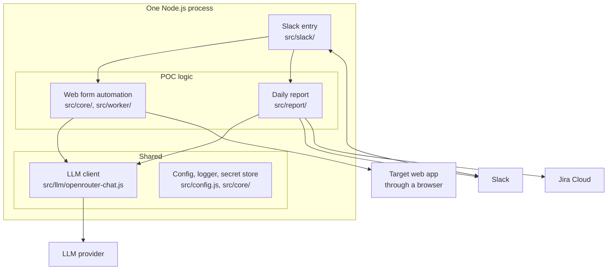

# Slack Automation Platform: Architecture

This document continues from [01-platform-overview.md](01-platform-overview.md) and assumes you have read it. It is for the engineer who maintains the platform or adds a POC to it: what is shared, how each outside system is connected, the rules every POC keeps, and where a new POC plugs in.

Each POC's own design is in its document: [web form automation](poc/01-web-form-automation.md) and [daily report](poc/02-daily-report.md). The AWS setup is in [03-aws-deployment.md](03-aws-deployment.md). How to run the repository locally is in the [README](../README.md).

## 1. What exists and what does not

| Part | Status |
|---|---|
| Slack connection, shared by both POCs | Built. Run locally and on AWS |
| LLM through OpenRouter, shared by both POCs | Built. Run locally and on AWS |
| LLM through Amazon Bedrock | **Not built.** Test calls were refused at account level; see [03-aws-deployment.md](03-aws-deployment.md), section 8 |
| Jira Cloud, read-only | Built. Run against a real site on 2026-10-06, from a laptop |
| Jira Cloud, writing | **Not built** |
| Browser automation | Built. Run against the mock portal only |
| AWS runtime | Run on 2026-10-05 for the first POC, then deleted. The daily report has not run on AWS |
| Confluence | **Not built.** Section 3.6 lists what is known and what has to be decided |

The repository grew from the first POC, and some names still show it: the Slack app is called "Visitor Registration POC", and one file registers the handlers of both POCs. Section 6 says where that matters.

## 2. Runtime

Everything runs in one Node.js 22 process. It connects to Slack with Socket Mode, an outbound WebSocket, so it needs no public address. Every other connection is an outbound HTTPS call.



| Module | Shared or POC | Responsibility |
|---|---|---|
| `src/config.js` | Shared | The only place that reads environment variables |
| `src/core/logger.js` | Shared | One JSON line per event to stdout |
| `src/core/secret-store.js` | Shared interface, one method so far | Sign-in credentials for the target web app |
| `src/llm/openrouter-chat.js` | Shared | One chat-completion call: messages in, text out |
| `src/slack/start-slack-app.js` | Shared | Builds every POC's service from the configuration and starts the app |
| `src/slack/slack-handlers.js` | Shared file, per-POC handlers | Slash commands, modal, buttons |
| `src/llm/parse-free-text-request.js`, `src/core/registration-*.js`, `src/worker/`, `src/slack/registration-modal.js`, `src/mock-portal/` | Web form automation | See its document |
| `src/llm/write-daily-report.js`, `src/report/` | Daily report | See its document |

A POC is switched on by its configuration. Without `OPENROUTER_API_KEY` the form opens empty; without the `REPORT_*` settings the `/daily-report` command answers that it is not configured. The process starts either way.

## 3. Integrations

### 3.1 Slack

One Slack app serves every POC, defined by `slack-app-manifest.yaml`.

| Aspect | How it is done |
|---|---|
| Connection | Socket Mode with an app-level token (`connections:write`). No request URL, no inbound port |
| Entry points | Slash commands: `/visitor`, `/daily-report`. A global shortcut opens the visitor form |
| Reading channels | `conversations.history` and `conversations.replies`, only in channels the bot has been invited to |
| Posting | `chat.postMessage`; files with `files.uploadV2` for screenshots |
| One process per app token | Slack spreads events across every connection on one token. Two processes would each see part of a conversation |

Scopes, by what needs them:

| Scope | Needed by |
|---|---|
| `commands`, `chat:write` | Both |
| `im:write`, `files:write` | Web form automation: results and screenshots go by direct message |
| `channels:history`, `groups:history`, `channels:read`, `groups:read`, `users:read` | Daily report: read messages, channel names and display names |
| `chat:write.customize` | Test data only: `npm run seed` posts under simulated names |

Adding a scope means updating the app from the manifest and reinstalling it to the workspace. Remove `chat:write.customize` from a production app.

### 3.2 LLM

Both POCs call one function:

```js
chatCompletion({ apiKey, model, messages, timeoutMs, fetchImpl })   // returns the answer as text
```

It posts to OpenRouter's chat-completions endpoint with `temperature: 0` and throws on a missing key, an HTTP error or an empty answer. Each caller owns its prompt and decides what to do with the text.

| Setting | Meaning |
|---|---|
| `OPENROUTER_API_KEY` | Switches the LLM on |
| `OPENROUTER_MODEL` | Model for the form pre-fill, and the default for everything else. Default `deepseek/deepseek-v4.1-flash` |
| `REPORT_MODEL` | Model for the daily report, when it should differ |

Where the LLM runs is decided in this one file:

| Placement | State | What changes |
|---|---|---|
| Outside AWS: OpenRouter | In use | Nothing |
| Inside AWS: Amazon Bedrock with a task role | Proposed, not built | The body of `chatCompletion` calls `Converse`; the key is replaced by an IAM role. Steps in [03-aws-deployment.md](03-aws-deployment.md), section 8 |
| Inside AWS: Bedrock's OpenAI-compatible endpoint | Not tried | The endpoint URL and the model ID; a Bedrock API key is still stored |

The provider is not yet selectable by configuration: switching means editing the function.

### 3.3 Jira Cloud

`fetchJiraIssues` in `src/report/jira-issues.js` makes one kind of call:

| Aspect | How it is done |
|---|---|
| Endpoint | `POST {site}/rest/api/3/search/jql`, paged with `nextPageToken`, up to 100 issues |
| Authentication | HTTP Basic with an Atlassian account's email and an API token |
| Fields read | Summary, status and its category, type, assignee, priority, due date, last update |
| Query | `JIRA_JQL`, or by default the project's open issues plus those updated in the last day |
| Writes | None |

An Atlassian API token carries every permission of the account it belongs to, across Jira and Confluence. Use a dedicated account that can only browse the projects the platform reads.

Two other ways to reach Jira were looked at, both existing tools that wrap the same REST API with the same three credentials: a Jira MCP server and a Jira command-line tool. They fit an AI agent that picks its own tools. The report runs one fixed query, so it calls the API directly.

### 3.4 Browser automation

Playwright drives Chromium inside the same container. Only the web form automation uses it. The rules for writing a script against a web application are in that POC's document, section 6.

The browser is the reason for the container size (1 vCPU, 2 GB) and for the Playwright base image. A deployment that runs only POCs without a browser could be much smaller; this has not been measured.

### 3.5 AWS

| Service | Use |
|---|---|
| ECS Fargate | Runs the one process as a service with exactly one task |
| Secrets Manager | Holds tokens and passwords; injected as environment variables when the task starts |
| CloudWatch Logs | Receives stdout |
| ECR | Holds the image |
| VPC with NAT Gateway and Elastic IP | The fixed outbound address. Needed only by a POC whose target checks the caller's IP |
| Amazon Bedrock | Proposed for the LLM |

The application calls no AWS API at run time, so it runs unchanged on a laptop.

### 3.6 Confluence (planned)

Nothing is built. What is known:

- Confluence Cloud on the same Atlassian site accepts the same email and API token as Jira, so no new kind of credential is needed. The warning in 3.3 about the token's reach applies here in full.
- Two uses have been named: publishing a report as a page, and reading project pages as context for the LLM.

To be decided before building: which of the two comes first; which space the platform may write to; and, for reading, how much page text may be sent to the LLM and through which provider.

A Confluence reader or writer would sit beside `src/report/jira-issues.js` as one module with one function per operation, taking its credentials as arguments.

## 4. Configuration

All settings are environment variables, read once in `src/config.js`. `.env.example` lists them with comments.

| Group | Variables | Secret |
|---|---|---|
| Slack | `SLACK_BOT_TOKEN`, `SLACK_APP_TOKEN` | Yes |
| LLM | `OPENROUTER_API_KEY`; `OPENROUTER_MODEL`, `REPORT_MODEL` | The key |
| Web form automation | `PORTAL_BASE_URL`, `PORTAL_USERNAME`, `PORTAL_PASSWORD`, `APPROVAL_TTL_SECONDS`, `BROWSER_HEADLESS` | Username and password |
| Daily report | `REPORT_CHANNELS`, `REPORT_POST_CHANNEL`, `REPORT_TIME`, `REPORT_LANGUAGE` | No |
| Jira | `JIRA_BASE_URL`, `JIRA_EMAIL`, `JIRA_API_TOKEN`, `JIRA_PROJECT_KEY`, `JIRA_JQL` | Email and token |
| Process | `TZ` | No |

`TZ` matters to both POCs: "tomorrow" in a form request, the day a report covers, and the time a report is posted are all computed in the process's clock, which is UTC in a container unless set.

## 5. Rules every POC keeps

- **LLM output is untrusted.** It is filtered or checked before use and never triggers an action. The form pre-fill drops malformed values; the report has user mentions neutralised before it is posted, so quoted chat cannot notify anyone.
- **Input text is data.** Prompts state that instructions inside the input are to be ignored. The daily report was tested with an instruction placed in an issue title.
- **Facts that need arithmetic are computed in code.** Whether an issue is overdue, or whether the chat mentions it, is worked out before the LLM sees the data and passed in as a flag.
- **An irreversible step needs a person.** The requester approves the exact screen before a form is submitted.
- **Output goes where an administrator pointed it.** A report is posted to a configured channel, not to the person who asked.
- **Personal data stays out of shared channels.** Form results go by direct message.
- **A failed dependency degrades, it does not stop the process.** No LLM: the form opens empty. Jira unreachable: the report is written from chat alone and says so.
- **Secrets come from the environment only**, and are never logged.
- **Outside systems are passed in.** Each service takes its Slack client, `fetch` and clock as arguments, so tests run without a network.

## 6. Adding a POC

The steps, with the daily report as the worked example:

| Step | Where | Daily report |
|---|---|---|
| 1. Settings | `src/config.js`, `.env.example` | The `REPORT_*` and `JIRA_*` groups |
| 2. A connector for each new outside system | One module, credentials as arguments, `fetchImpl` injectable | `src/report/jira-issues.js`, `src/report/slack-channel-history.js` |
| 3. The prompt, if an LLM is used | `src/llm/`, calling `chatCompletion` | `src/llm/write-daily-report.js` |
| 4. The service that holds the logic | Its own folder under `src/` | `src/report/daily-report-service.js` |
| 5. A factory that returns `null` when the POC is not configured | Beside the service | `src/report/configured-reporter.js` |
| 6. Slack entry point | A handler in `src/slack/slack-handlers.js`; a command and scopes in `slack-app-manifest.yaml` | `/daily-report` |
| 7. Wiring | `src/slack/start-slack-app.js` | Builds the reporter, passes it to the handlers, starts the schedule |
| 8. A way to run it without Slack | `scripts/` | `scripts/run-daily-report.js` |
| 9. Tests and sample data | `test/`, `test/fixtures/` | `test/daily-report.test.js` and three fixtures |
| 10. Documentation | `docs/poc/NN-name.md`; one row in the tables of the overview and of this document | [poc/02-daily-report.md](poc/02-daily-report.md) |

What is not yet modular, and will need attention as POCs are added:

| Limitation | Effect |
|---|---|
| `slack-handlers.js` holds the handlers of every POC | The file grows with each POC. Splitting it per POC is a mechanical change |
| The connectors for the daily report live in `src/report/` | A second POC that reads Jira or Slack history would import from another POC's folder, or the connectors move to a shared folder first |
| `secret-store.js` has one method, for the web app's credentials | Other secrets are read through `config.js` |
| One process, one task | Every POC restarts together, and a POC that holds state in memory fixes the task count at one for all of them |
| The Slack app's name and bot name are the first POC's | Cosmetic; changed in the manifest |

## 7. Tests and test data

`npm test` runs 42 tests. Eleven of them call the real model and run only when `OPENROUTER_API_KEY` is set: ten sentences for the form pre-fill and one sample day for the report. The rest use a real browser against the mock portal, or fakes for Slack and Jira.

| Data | File | Used by |
|---|---|---|
| Ten free-text requests with expected fields | `test/fixtures/free-text-requests.js` | Tests |
| One invented project day, already in the shape the readers return | `test/fixtures/daily-report-sample.js` | Tests; `npm run report -- --sample` |
| The same day as 25 Slack messages with threads and noise | `test/fixtures/channel-dump.js` | `npm run seed`, which posts them to a real channel |
| 17 Jira issues, one per case the report should handle | `test/fixtures/jira-seed-issues.js` | `npm run seed:jira`, which creates them in a real project |

The two seed scripts print what they would do and change nothing unless `--post` is given.

## 8. Gaps to production

Gaps of the platform as a whole. Each POC's document lists its own.

| Area | Now | Needed |
|---|---|---|
| Who may use it | Anyone in the workspace can run any command | A list of permitted people or groups per command |
| Audit | JSON log to stdout, kept 7 days | A record of who asked for what, and when |
| Monitoring | None | An alert on error rate and on a missed scheduled run |
| LLM provider | Outside AWS, fixed in code | Bedrock, selectable by configuration |
| Atlassian credentials | A personal account's token in the trial | A dedicated account with read access to named projects only |
| Slack scopes | Include a test-only scope | Remove `chat:write.customize` |
| State and schedule | In the memory of one process | Durable state; a schedule outside the process |
| Outbound rules | The security group allows every port | TCP 443 only |
| Infrastructure as code | The commands in the deployment document | A template once the configuration settles |
| Secret rotation | Manual | A schedule for the Slack tokens, the LLM key, the Atlassian token and the web app password |
