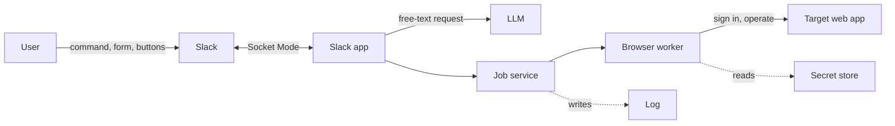
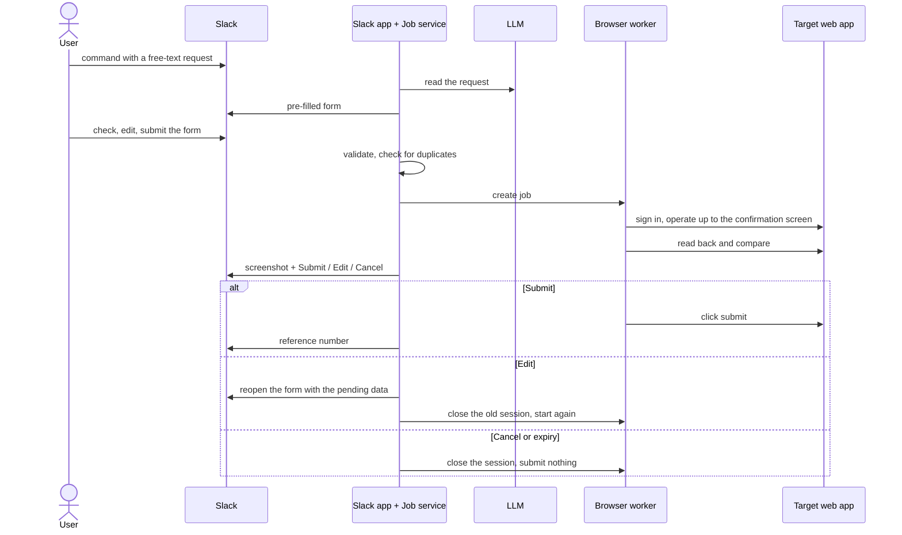
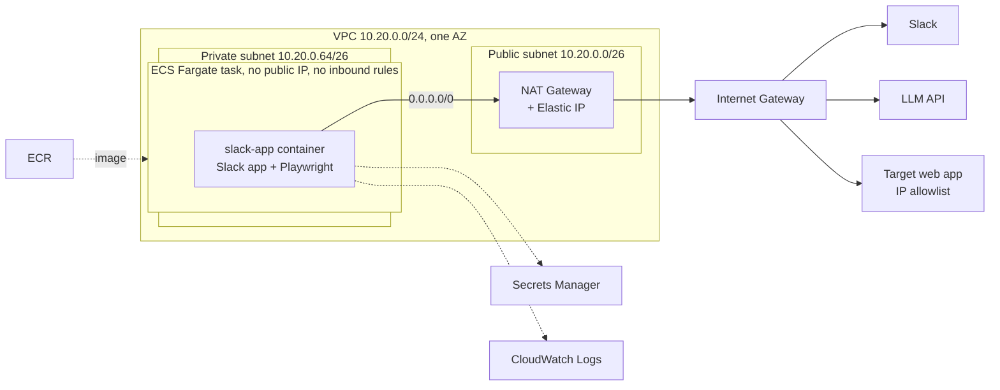

# Slack-Triggered Web Automation: Solution Architecture

This document is for engineers who need to reproduce the solution in a real organisation: a user asks for something in Slack, the system does it for them on a web application through browser automation, and that web application **only accepts connections from registered IP addresses**. The summary for decision makers is in [01-executive-overview.md](01-executive-overview.md).

This repository is the proof of concept (POC). Its example is a three-step registration form on a simulated website, the mock portal.

## 1. Verification status

Read this table first. The document mixes parts that were run for real with parts written from the design, and each step is labelled.

| Part | Status |
|---|---|
| Application flow (Slack, LLM pre-fill, worker, approval, duplicate check) | Verified locally, with automated tests that drive a real browser |
| ECR, Secrets Manager, execution role, log group, two-container task definition, ECS service on Fargate | **Run on AWS on 2026-10-05**: `ap-southeast-2`, Free plan of the new AWS experience, `ARM64` image, zsh |
| Network used in that run | Default VPC, public subnet, `assignPublicIp=ENABLED`. This is **not** the target architecture |
| Dedicated VPC, private subnet, NAT Gateway, Elastic IP, `assignPublicIp=DISABLED` (steps 5.5 and 5.8) | **Not run.** The commands were checked for syntax and for zsh variable expansion, and never sent to AWS |
| Outbound IP check (step 5.7) | **Not run** |
| Single-container task definition for the real web app (section 6) | **Not run** |
| Deploying a new version (section 8.1) | **Not run** |
| Cleanup (section 8.3) | **Run on 2026-10-05** for everything except the VPC, NAT and Elastic IP, which never existed. Run through the equivalent API calls, not the CLI commands as printed |
| LLM through OpenRouter | Run, locally and on AWS |
| LLM through Amazon Bedrock (section 10) | **Not run.** A test call on 2026-10-05 was refused at account level; see section 10.1 |
| Real web app, SSO, CAPTCHA, several concurrent users | Not verified |

The measurements from the 2026-10-05 run are in section 7. The POC environment was deleted after that run; nothing from it is still deployed.

## 2. Problem and constraint

A group of users repeat one task on a web application: sign in, fill in a form, check it, submit. The web application has no usable API. The users work in Slack all day and want to make the request there.

One constraint decides the infrastructure: **the web application restricts access by source IP.** A Fargate task in a public subnet gets a new public IP every time it starts, so that IP cannot be registered. Every outbound connection has to leave from one fixed address.

The solution fits when:

- The task has repeatable steps and well-structured input.
- The web application has no usable API. Where an API exists, calling it is always cheaper and more durable than driving a browser.
- The web application's owner allows automated use through an issued account, and will register an IP.
- A delay of a few seconds to a few tens of seconds per request is acceptable.

It does not fit when:

- The web application blocks automation with a CAPTCHA, or asks for a one-time code at every sign-in.
- Its terms of use forbid automated access.
- Its screens change often without notice, and nobody owns selector maintenance.
- The volume is large and needs batch processing: negotiate an API or another data channel.

## 3. Application architecture

### 3.1 Components



| Component | Responsibility | In the repo |
|---|---|---|
| Slack app | Receives the command, opens the form, returns per-field errors, sends the screenshot and the approval buttons | `src/slack/` |
| Field definitions | Fields, input types, normalisation, validation rules, display | `src/core/registration-fields.js` |
| LLM pre-fill | Turns a free-text request into suggested values; drops malformed values | `src/llm/` |
| Job service | Lifecycle of one request: validation, duplicate check, the session awaiting approval, expiry, who may approve | `src/core/registration-service.js` |
| Browser worker | Signs in, operates the site, compares the confirmation screen, submits once approved | `src/worker/` |
| Secret store | One interface for sign-in credentials; the source can change without touching the worker | `src/core/secret-store.js` |
| Target web app | In the POC, a simulated website | `src/mock-portal/` |

Everything runs in one Node.js 22 process. The Slack app connects with Socket Mode: the process opens the connection out to Slack, so it needs no public address, no load balancer and no request signature check.

### 3.2 Flow



The browser stays open on the confirmation screen while the job waits for approval. What the user sees in the screenshot is exactly what gets submitted; no second fill happens in between. The consequence: job state lives in the memory of one process, and the infrastructure must run exactly one copy.

### 3.3 Design principles

| Principle | What it means | Why |
|---|---|---|
| A person approves the irreversible step | Automation stops at the confirmation screen and submits only after the requester approves | A mistake while filling can be fixed; a mistake after submitting cannot |
| The LLM only suggests | The LLM reads the request and pre-fills the Slack form. The data that reaches the web app is what the user confirmed | LLM output is not stable; it must not create a transaction directly |
| One definition of the data | Fields, input types and rules live in one place; the Slack form, the LLM prompt and the web fill are all generated from it | Adding a field means changing one place |
| Validate early, then validate again | Rules known in advance are checked in Slack. Rules only the web app knows are read from its error message and passed on word for word | The user gets the error on the right field without waiting for the browser |
| Read back before trusting | After filling, the worker reads the confirmation screen and compares it with the requested data | Catches wrong fills, drifted selectors and values the web app changed by itself |
| Never submit twice | Each request has a key built from the requester and the content; duplicates are rejected | Slack can redeliver events, and users can click twice |
| Secrets never pass through Slack | The web app account sits in the secret store and only the worker reads it. The logger redacts fields that look like secrets | Slack and logs are read by many people |
| Personal data stays in a private channel | Details and screenshots go by direct message; the shared channel gets one line saying the request was received | The shared channel includes people who are not involved |

### 3.4 Error handling

| Situation | Behaviour |
|---|---|
| Data breaks a rule known in advance | The Slack form shows the error on the field; the browser does not run |
| The web app rejects by its own rule | The worker reads the error on the page; Slack shows it word for word |
| The confirmation screen differs from the requested data | Stop, name the mismatched fields, do not allow approval |
| Sign-in fails | Stop and report; the password does not appear in the log |
| The web app asks for a CAPTCHA or a one-time code | Stop and report that a person is needed |
| Duplicate request | Reject, with the reference number if it was already submitted |
| Someone else clicks approve, edit or cancel | Reject |
| Nobody approves in time | Close the browser, submit nothing |
| Edit after the original was submitted or cancelled | Do not apply the change and do not create a second request |
| The LLM cannot read the request or returns a bad format | The form opens empty with a note, and the user fills it in |

## 4. AWS infrastructure architecture



Every connection the task makes leaves through the NAT Gateway, including the image pull, the secret read and the log writes. From outside, all of it carries one address: the NAT Gateway's Elastic IP.

| Decision | Reason | Alternatives considered |
|---|---|---|
| ECS Fargate, one task | No servers to manage. A long-lived process suits the Socket Mode connection and a browser held open during approval | EC2: machines to patch and monitor. Lambda: 15-minute limit, cannot hold a WebSocket. EKS: too heavy for one service |
| Private subnet, NAT Gateway, Elastic IP | A fixed outbound IP that survives task restarts and is run by AWS | Task public IP: changes on every start. NAT instance on EC2: cheaper but self-managed. Third-party proxy: traffic and credentials pass through an outside party. VPN or PrivateLink: the web app's owner has to build it too; Site-to-Site VPN is not available in projects of the new AWS experience |
| One AZ, one NAT Gateway | There is one task; a second AZ adds a second NAT (about 43 USD a month) without adding real availability. NAT and task share an AZ, so there is no cross-AZ data charge | Two AZs: two NATs and **two IPs to register**. Only when there is a stated availability requirement |
| No load balancer; security group with no inbound rules | Socket Mode is an outbound connection | HTTP Events API: needs a public endpoint and signature checks |
| Secrets Manager, injected as environment variables at task start | `EnvSecretStore` is reused unchanged, with no code change. Only the execution role can read the secret | Parameter Store: also works, and is cheaper. Secrets Manager was chosen for its built-in rotation support |
| Task count fixed at 1, `minimumHealthyPercent=0`, `maximumPercent=100` | Job state is in memory. Two copies would split Slack's events, and an approval click could reach the copy that does not hold the job | Several copies: needs durable state first (section 9) |
| LLM: OpenRouter in the POC, Amazon Bedrock proposed for a real organisation | Bedrock keeps the data inside AWS, uses IAM in place of an API key, and bills with everything else. Detail in section 10 | Stay on OpenRouter: one more data processor and one more key to manage. SageMaker: hourly cost and self-operation |
| No VPC endpoints | NAT is already there, and traffic to ECR, Secrets Manager and Logs is tiny. Each task start pulls about 950 MB through NAT, about 0.06 USD | Interface endpoints: each is billed hourly and costs more than the traffic it saves |

## 5. Reproducing it step by step

### 5.1 Prerequisites

- An AWS account (in the new AWS experience: a project) and an identity with permissions for ECR, ECS, IAM, Secrets Manager, CloudWatch Logs, and EC2 (VPC, subnets, route tables, internet gateway, NAT gateway, Elastic IP, security groups).
- AWS CLI v2, signed in: `aws sts get-caller-identity` returns the right account.
- Docker running.
- The Slack app installed in the workspace from `slack-app-manifest.yaml`, with `SLACK_BOT_TOKEN` and `SLACK_APP_TOKEN` as in the local setup in the [README](../README.md).

**Stop the local Slack app before deploying.** Two processes on the same app token split the events Slack sends.

```bash
export AWS_REGION=ap-southeast-2              # change to your region
export AWS_PROFILE=slack-web-automation-poc   # only when signing in with a named profile
export APP=slack-web-automation-poc
export ACCOUNT_ID=$(aws sts get-caller-identity --query Account --output text)
export IMAGE=$ACCOUNT_ID.dkr.ecr.$AWS_REGION.amazonaws.com/$APP:v1
```

In the new AWS experience each project can use one region only; take the region from AWS Settings.

The braces in `${ACCOUNT_ID}:role`, `${SECRET_ARN}:NAME` and `${AWS_REGION}a` are deliberate. In zsh, `$ACCOUNT_ID:role` and `$SECRET_ARN:PORTAL_…` are read as the `:r` and `:P` modifiers and produce a broken ARN with no error.

### 5.2 Image (run)

```bash
aws ecr create-repository --repository-name $APP --region $AWS_REGION
aws ecr get-login-password --region $AWS_REGION \
  | docker login --username AWS --password-stdin $ACCOUNT_ID.dkr.ecr.$AWS_REGION.amazonaws.com

docker build -t $IMAGE .
docker push $IMAGE
```

The image is about 3.5 GB locally because the Playwright base image carries all three browsers; in ECR it takes about 950 MB.

Note the CPU architecture of the build machine: Apple Silicon produces an `ARM64` image, Intel/AMD produces `X86_64`. It has to match `cpuArchitecture` in step 5.6.

### 5.3 Secrets (run)

Create a temporary file **outside the repo**, fill in the real values, create the secret from the file, then delete the file. This keeps the values out of shell history.

```bash
cat > /tmp/poc-secrets.json <<'JSON'
{
  "SLACK_BOT_TOKEN": "…",
  "SLACK_APP_TOKEN": "…",
  "OPENROUTER_API_KEY": "…",
  "PORTAL_USERNAME": "demo-operator",
  "PORTAL_PASSWORD": "…"
}
JSON

aws secretsmanager create-secret --name $APP --secret-string file:///tmp/poc-secrets.json --region $AWS_REGION
rm /tmp/poc-secrets.json
export SECRET_ARN=$(aws secretsmanager describe-secret --secret-id $APP --region $AWS_REGION --query ARN --output text)
```

With the mock portal, `PORTAL_USERNAME` and `PORTAL_PASSWORD` can be any value: both containers read the same secret, so they always match. To run without the LLM, leave out the `OPENROUTER_API_KEY` line here and in step 5.6.

### 5.4 Permissions and logs (run)

```bash
cat > /tmp/trust.json <<'JSON'
{ "Version": "2012-10-17", "Statement": [{ "Effect": "Allow", "Principal": { "Service": "ecs-tasks.amazonaws.com" }, "Action": "sts:AssumeRole" }] }
JSON

aws iam create-role --role-name $APP-execution --assume-role-policy-document file:///tmp/trust.json
aws iam attach-role-policy --role-name $APP-execution \
  --policy-arn arn:aws:iam::aws:policy/service-role/AmazonECSTaskExecutionRolePolicy
aws iam put-role-policy --role-name $APP-execution --policy-name read-secret --policy-document "{
  \"Version\": \"2012-10-17\",
  \"Statement\": [{ \"Effect\": \"Allow\", \"Action\": \"secretsmanager:GetSecretValue\", \"Resource\": \"$SECRET_ARN\" }]
}"

aws logs create-log-group --log-group-name /ecs/$APP --region $AWS_REGION
aws logs put-retention-policy --log-group-name /ecs/$APP --retention-in-days 7 --region $AWS_REGION
```

The application calls no AWS service at run time, so it needs no task role. It will need one when the LLM moves to Bedrock (section 10.3).

### 5.5 Network: VPC, private subnet, NAT (not run)

Pick a CIDR range that does not overlap the organisation's internal network, in case a VPN or peering connection is needed later.

```bash
export AZ=${AWS_REGION}a

# VPC and two subnets in the same AZ
export VPC_ID=$(aws ec2 create-vpc --cidr-block 10.20.0.0/24 \
  --tag-specifications "ResourceType=vpc,Tags=[{Key=Name,Value=$APP}]" \
  --query Vpc.VpcId --output text --region $AWS_REGION)
export PUBLIC_SUBNET_ID=$(aws ec2 create-subnet --vpc-id $VPC_ID --cidr-block 10.20.0.0/26 \
  --availability-zone $AZ --query Subnet.SubnetId --output text --region $AWS_REGION)
export PRIVATE_SUBNET_ID=$(aws ec2 create-subnet --vpc-id $VPC_ID --cidr-block 10.20.0.64/26 \
  --availability-zone $AZ --query Subnet.SubnetId --output text --region $AWS_REGION)

# Public subnet: route out through the internet gateway
export IGW_ID=$(aws ec2 create-internet-gateway --query InternetGateway.InternetGatewayId --output text --region $AWS_REGION)
aws ec2 attach-internet-gateway --internet-gateway-id $IGW_ID --vpc-id $VPC_ID --region $AWS_REGION
export PUBLIC_RT_ID=$(aws ec2 create-route-table --vpc-id $VPC_ID --query RouteTable.RouteTableId --output text --region $AWS_REGION)
aws ec2 create-route --route-table-id $PUBLIC_RT_ID --destination-cidr-block 0.0.0.0/0 --gateway-id $IGW_ID --region $AWS_REGION
aws ec2 associate-route-table --route-table-id $PUBLIC_RT_ID --subnet-id $PUBLIC_SUBNET_ID --region $AWS_REGION

# Elastic IP and NAT Gateway in the public subnet
export EIP_ALLOC_ID=$(aws ec2 allocate-address --domain vpc --query AllocationId --output text --region $AWS_REGION)
export EGRESS_IP=$(aws ec2 describe-addresses --allocation-ids $EIP_ALLOC_ID --query 'Addresses[0].PublicIp' --output text --region $AWS_REGION)
export NAT_ID=$(aws ec2 create-nat-gateway --subnet-id $PUBLIC_SUBNET_ID --allocation-id $EIP_ALLOC_ID \
  --query NatGateway.NatGatewayId --output text --region $AWS_REGION)
aws ec2 wait nat-gateway-available --nat-gateway-ids $NAT_ID --region $AWS_REGION

# Private subnet: route out through NAT
export PRIVATE_RT_ID=$(aws ec2 create-route-table --vpc-id $VPC_ID --query RouteTable.RouteTableId --output text --region $AWS_REGION)
aws ec2 create-route --route-table-id $PRIVATE_RT_ID --destination-cidr-block 0.0.0.0/0 --nat-gateway-id $NAT_ID --region $AWS_REGION
aws ec2 associate-route-table --route-table-id $PRIVATE_RT_ID --subnet-id $PRIVATE_SUBNET_ID --region $AWS_REGION

# Security group: no inbound rules, all outbound allowed by default
export SG_ID=$(aws ec2 create-security-group --group-name $APP --description "$APP: outbound only" \
  --vpc-id $VPC_ID --query GroupId --output text --region $AWS_REGION)

echo "Address to register with the web app owner: $EGRESS_IP"
```

`$EGRESS_IP` is the address to give the web app's owner. It stays the same for as long as the Elastic IP is not released: deleting the NAT Gateway and creating a new one with the same `$EIP_ALLOC_ID` keeps the address.

The NAT Gateway is billed from the moment it is created, including while the service runs zero tasks.

### 5.6 Task definition (run, in the two-container form with the mock portal)

Change `ARM64` to `X86_64` if the image was built on Intel/AMD. Change `TZ` to the users' time zone: "tomorrow" and the past-date rule are computed in the container's clock, which defaults to UTC.

```bash
cat > /tmp/taskdef.json <<JSON
{
  "family": "$APP",
  "networkMode": "awsvpc",
  "requiresCompatibilities": ["FARGATE"],
  "cpu": "1024",
  "memory": "2048",
  "runtimePlatform": { "cpuArchitecture": "ARM64", "operatingSystemFamily": "LINUX" },
  "executionRoleArn": "arn:aws:iam::${ACCOUNT_ID}:role/$APP-execution",
  "containerDefinitions": [
    {
      "name": "portal",
      "image": "$IMAGE",
      "essential": true,
      "command": ["node", "src/mock-portal/start-mock-portal.js"],
      "environment": [{ "name": "MOCK_PORTAL_PORT", "value": "4010" }],
      "secrets": [
        { "name": "PORTAL_USERNAME", "valueFrom": "${SECRET_ARN}:PORTAL_USERNAME::" },
        { "name": "PORTAL_PASSWORD", "valueFrom": "${SECRET_ARN}:PORTAL_PASSWORD::" }
      ],
      "logConfiguration": { "logDriver": "awslogs", "options": { "awslogs-group": "/ecs/$APP", "awslogs-region": "$AWS_REGION", "awslogs-stream-prefix": "portal" } }
    },
    {
      "name": "slack-app",
      "image": "$IMAGE",
      "essential": true,
      "dependsOn": [{ "containerName": "portal", "condition": "START" }],
      "environment": [
        { "name": "PORTAL_BASE_URL", "value": "http://127.0.0.1:4010" },
        { "name": "TZ", "value": "Asia/Ho_Chi_Minh" }
      ],
      "secrets": [
        { "name": "SLACK_BOT_TOKEN", "valueFrom": "${SECRET_ARN}:SLACK_BOT_TOKEN::" },
        { "name": "SLACK_APP_TOKEN", "valueFrom": "${SECRET_ARN}:SLACK_APP_TOKEN::" },
        { "name": "OPENROUTER_API_KEY", "valueFrom": "${SECRET_ARN}:OPENROUTER_API_KEY::" },
        { "name": "PORTAL_USERNAME", "valueFrom": "${SECRET_ARN}:PORTAL_USERNAME::" },
        { "name": "PORTAL_PASSWORD", "valueFrom": "${SECRET_ARN}:PORTAL_PASSWORD::" }
      ],
      "logConfiguration": { "logDriver": "awslogs", "options": { "awslogs-group": "/ecs/$APP", "awslogs-region": "$AWS_REGION", "awslogs-stream-prefix": "slack" } }
    }
  ]
}
JSON

aws ecs register-task-definition --cli-input-json file:///tmp/taskdef.json --region $AWS_REGION
aws ecs create-cluster --cluster-name $APP --region $AWS_REGION
```

Two containers in one task share `localhost`, so the mock portal runs alongside the app with no code change. Use this form to verify the infrastructure first, then move to the single-container form in section 6.

If the command returns `ClientException: Role is not valid`, open `/tmp/taskdef.json` and look at `executionRoleArn` and the `valueFrom` entries. In the verification run this error came from ARNs that zsh had mangled (step 5.1), not from IAM permissions or propagation delay after creating the role.

### 5.7 Confirm the outbound IP (not run)

Do this **before** sending the address to the web app's owner and before creating the service. Run a one-off task in the private subnet, replacing the `slack-app` container's command with one that asks for its own public IP:

```bash
aws ecs run-task --cluster $APP --task-definition $APP --launch-type FARGATE \
  --network-configuration "awsvpcConfiguration={subnets=[$PRIVATE_SUBNET_ID],securityGroups=[$SG_ID],assignPublicIp=DISABLED}" \
  --overrides '{"containerOverrides":[{"name":"slack-app","command":["node","-e","fetch(\"https://checkip.amazonaws.com\").then(r=>r.text()).then(console.log)"]}]}' \
  --region $AWS_REGION

# wait about a minute, then read the log
aws logs tail /ecs/$APP --log-stream-name-prefix slack --since 5m --region $AWS_REGION
echo $EGRESS_IP
```

It passes when the address printed in the log equals `$EGRESS_IP`. The replaced command opens no connection to Slack; the `slack-app` container exits right after printing, and because it is `essential` the whole task stops with it.

A task that passes this step also proves that the private subnet can pull the image, read the secret and write logs through NAT. If the task sits in `PENDING` and then stops with an image pull or secret error, check the private subnet's `0.0.0.0/0` route and the NAT Gateway's state.

Once connected to the real web app, also compare against the owner's access log.

### 5.8 Service (run with a public subnet; the private-subnet configuration below is not run)

```bash
aws ecs create-service --cluster $APP --service-name $APP --task-definition $APP \
  --desired-count 1 --launch-type FARGATE \
  --deployment-configuration minimumHealthyPercent=0,maximumPercent=100 \
  --network-configuration "awsvpcConfiguration={subnets=[$PRIVATE_SUBNET_ID],securityGroups=[$SG_ID],assignPublicIp=DISABLED}" \
  --region $AWS_REGION
```

`minimumHealthyPercent=0,maximumPercent=100` makes ECS stop the old task before starting the new one, so there are never two Socket Mode connections at once.

The only difference from the 2026-10-05 run is the two network parameters: that run used a public subnet of the default VPC and `assignPublicIp=ENABLED`. In that run the Slack app was connected about 40 seconds after the service started the task.

### 5.9 Verification

1. Wait for the task to run, then read the log:

```bash
aws ecs describe-services --cluster $APP --services $APP --region $AWS_REGION \
  --query 'services[0].{running:runningCount,events:events[0:3].message}'
aws logs tail /ecs/$APP --since 10m --region $AWS_REGION
```

Expect `Mock portal listening on http://127.0.0.1:4010` and a line with `"event":"slack_app_started"` and `"llmPrefill":true`.

2. Run the test sentences from the README in Slack. Each approval should leave the sequence `job_started`, `job_awaiting_approval`, `approval_requested`, `job_submitted` with a reference number.

| Situation | Log line |
|---|---|
| Cancel clicked | `job_cancelled` |
| Edit clicked, then saved | `job_cancelled` for the old session, followed at once by `job_started` with a new `jobId` |
| The website rejects the form | `job_failed` and `prepare_failed` at level `error`, with `code` set to `form_rejected` and `message` holding the website's error word for word |

Validation errors in the modal, requests with missing information and sentences that are not registration requests create no job, so they leave no log line.

3. Compare against the table in section 7, and do the items still marked "not tried".

The mock portal's `/api/submissions` page is reachable only inside the task. The reference number Slack returns is issued by the website after it stores the record, so it is sufficient evidence. To look directly, enable ECS Exec on the service; that needs a task role with `ssmmessages` permissions and the Session Manager plugin locally.

## 6. Moving to the real web app

Suggested order: build the network, confirm the IP (5.7), run with the mock portal (5.8, 5.9), and only then switch to the real web app. That keeps infrastructure faults and worker faults apart.

### 6.1 Work outside the code

- Written approval from the web app's owner for automated access.
- A dedicated automation account with minimum permissions, exempt from CAPTCHA and one-time codes. Everything done on the web app will be recorded under this account.
- The owner adds `$EGRESS_IP` to the allowlist.

### 6.2 Work in the code

The framework stays; three places are rewritten:

1. **Field definitions** (`src/core/registration-fields.js`). Declare the fields, input types and rules of the new business task. The Slack form and the LLM prompt follow automatically.
2. **Browser worker** (`src/worker/`). Rewrite the sign-in, the steps, the confirmation-screen read and the submit. Keep the boundary: one function that goes as far as the stopping point, and a separate function for the irreversible step.
3. **Command name and Slack wording** (`src/slack/`, `slack-app-manifest.yaml`).

Advice on selectors:

- Prefer the labels and roles a user sees (label, role, button name). They change less often than CSS classes and DOM structure.
- Wait on page state (an element appears, the options have loaded), not on fixed delays.
- Always read back. When the screen changes, this turns a silent fault into a reported one.
- Run a test request on a schedule, up to the stopping point, then cancel it, to learn early when the web app changes.

If the task has no confirmation screen of its own, create the stopping point: stop before the last button, take a screenshot and read back the fields that were filled.

### 6.3 Work on AWS (not run)

Put the real account into the secret, using a temporary file as in step 5.3:

```bash
aws secretsmanager put-secret-value --secret-id $APP --secret-string file:///tmp/poc-secrets.json --region $AWS_REGION
rm /tmp/poc-secrets.json
```

The task definition drops the `portal` container and points `PORTAL_BASE_URL` at the real web app:

```bash
export PORTAL_BASE_URL=https://webapp.example.com   # the real web app's address

cat > /tmp/taskdef.json <<JSON
{
  "family": "$APP",
  "networkMode": "awsvpc",
  "requiresCompatibilities": ["FARGATE"],
  "cpu": "1024",
  "memory": "2048",
  "runtimePlatform": { "cpuArchitecture": "ARM64", "operatingSystemFamily": "LINUX" },
  "executionRoleArn": "arn:aws:iam::${ACCOUNT_ID}:role/$APP-execution",
  "containerDefinitions": [
    {
      "name": "slack-app",
      "image": "$IMAGE",
      "essential": true,
      "environment": [
        { "name": "PORTAL_BASE_URL", "value": "$PORTAL_BASE_URL" },
        { "name": "TZ", "value": "Asia/Ho_Chi_Minh" }
      ],
      "secrets": [
        { "name": "SLACK_BOT_TOKEN", "valueFrom": "${SECRET_ARN}:SLACK_BOT_TOKEN::" },
        { "name": "SLACK_APP_TOKEN", "valueFrom": "${SECRET_ARN}:SLACK_APP_TOKEN::" },
        { "name": "OPENROUTER_API_KEY", "valueFrom": "${SECRET_ARN}:OPENROUTER_API_KEY::" },
        { "name": "PORTAL_USERNAME", "valueFrom": "${SECRET_ARN}:PORTAL_USERNAME::" },
        { "name": "PORTAL_PASSWORD", "valueFrom": "${SECRET_ARN}:PORTAL_PASSWORD::" }
      ],
      "logConfiguration": { "logDriver": "awslogs", "options": { "awslogs-group": "/ecs/$APP", "awslogs-region": "$AWS_REGION", "awslogs-stream-prefix": "slack" } }
    }
  ]
}
JSON

aws ecs register-task-definition --cli-input-json file:///tmp/taskdef.json --region $AWS_REGION
aws ecs update-service --cluster $APP --service $APP --task-definition $APP --region $AWS_REGION
```

Secrets are injected only when a task starts. After changing a secret value without changing the task definition, force a new task with `aws ecs update-service --cluster $APP --service $APP --force-new-deployment --region $AWS_REGION`.

## 7. Verification results, 2026-10-05

Conditions: the two-container form, a public subnet of the default VPC, 5 requests sent from Slack over about three minutes, one after another.

| What to check | Passes when | Result |
|---|---|---|
| Chromium runs on Fargate | The confirmation screenshot arrives in Slack | Pass. Four requests reached the confirmation screen; two were approved and received reference numbers |
| The website rejects a request | Slack shows the website's error word for word | Pass. The log recorded `form_rejected` with the overlapping-time message |
| Enough memory | No task is stopped for lack of memory | Partial pass. Peak memory 9.9% of 2 GB, peak CPU 7.2% (one-minute data), no task stopped. Two requests awaiting approval at once was not tried |
| No secrets leak | Searching the log for token prefixes and the password finds nothing | Pass for the prefixes `xoxb-`, `xapp-`, `sk-or-`. The website password was not searched for |
| Time zone | The pre-filled date is right in local time | Pass. "tomorrow" sent at 23:29 on 5 October, Vietnam time, produced a reference number dated 6 October |
| Latency | Acceptable to users | About 1 second to `job_awaiting_approval`, about 3 seconds to `approval_requested` |
| Self-recovery | After `aws ecs stop-task`, the service starts a new task and the Slack command works again | Not tried |
| Edit and expiry | Same behaviour as locally | Edit: the log matches one Edit (old session closed, new session approved). Expiry after 10 minutes: not tried |
| Fixed outbound IP | The address seen from outside equals the Elastic IP | Not tried (step 5.7) |
| Cleanup | No POC resource remains | Pass. A follow-up inventory of the region found none |

Latency was measured with the mock portal on `localhost`. Against a real web app through NAT, it will depend mostly on how fast that web app responds.

## 8. Operations

### 8.1 Deploying a new version (not run)

```bash
export IMAGE=$ACCOUNT_ID.dkr.ecr.$AWS_REGION.amazonaws.com/$APP:v2
docker build -t $IMAGE . && docker push $IMAGE
# recreate /tmp/taskdef.json with the new IMAGE, then:
aws ecs register-task-definition --cli-input-json file:///tmp/taskdef.json --region $AWS_REGION
aws ecs update-service --cluster $APP --service $APP --task-definition $APP --region $AWS_REGION
```

Deploy only when no request is awaiting approval: the old task stops before the new one starts, and pending requests are lost.

### 8.2 Cost

On-demand list prices in `ap-southeast-2`, fetched on 2026-10-05, for 730 hours a month:

| Item | Unit price | USD per month |
|---|---|---|
| NAT Gateway | 0.059 USD per hour, plus 0.059 USD per GB processed | about 43.1 |
| Fargate ARM, 1 vCPU and 2 GB | 0.03885 USD per vCPU-hour, 0.00426 USD per GB-hour | about 34.6 |
| Public IPv4 address (Elastic IP) | 0.005 USD per hour | about 3.7 |
| Secrets Manager | 0.40 USD per secret | 0.4 |
| ECR | 0.10 USD per GB | about 0.1 |
| CloudWatch Logs | 0.033 USD per GB stored | negligible |
| **Total** | | **about 82** |

The memory and CPU figures in section 7 show the task has a lot of headroom. The task size was left alone because nothing was measured with several browsers awaiting approval.

To pause the task and keep the configuration:

```bash
aws ecs update-service --cluster $APP --service $APP --desired-count 0 --region $AWS_REGION
```

This stops the Fargate charge only. The NAT Gateway and the Elastic IP keep billing. To stop the NAT charge and keep the registered address: delete the NAT Gateway, **keep the Elastic IP**, and create a new NAT with the same `$EIP_ALLOC_ID` when needed (the private subnet's `0.0.0.0/0` route has to be recreated).

### 8.3 Cleanup (run on 2026-10-05, except the network block)

Order matters: the NAT Gateway must be fully deleted before the Elastic IP can be released and the subnets deleted. **Releasing the Elastic IP gives up the address registered with the web app's owner, and it cannot be recovered.**

```bash
aws ecs update-service --cluster $APP --service $APP --desired-count 0 --region $AWS_REGION
aws ecs delete-service --cluster $APP --service $APP --force --region $AWS_REGION
aws ecs delete-cluster --cluster $APP --region $AWS_REGION
aws ecs deregister-task-definition --task-definition $APP:1 --region $AWS_REGION   # repeat for each revision

# network block: not run, because the POC used the default VPC
aws ec2 delete-nat-gateway --nat-gateway-id $NAT_ID --region $AWS_REGION
aws ec2 wait nat-gateway-deleted --nat-gateway-ids $NAT_ID --region $AWS_REGION
aws ec2 release-address --allocation-id $EIP_ALLOC_ID --region $AWS_REGION

aws ec2 delete-security-group --group-id $SG_ID --region $AWS_REGION

# network block, continued: not run
aws ec2 delete-subnet --subnet-id $PRIVATE_SUBNET_ID --region $AWS_REGION
aws ec2 delete-subnet --subnet-id $PUBLIC_SUBNET_ID --region $AWS_REGION
aws ec2 delete-route-table --route-table-id $PRIVATE_RT_ID --region $AWS_REGION
aws ec2 delete-route-table --route-table-id $PUBLIC_RT_ID --region $AWS_REGION
aws ec2 detach-internet-gateway --internet-gateway-id $IGW_ID --vpc-id $VPC_ID --region $AWS_REGION
aws ec2 delete-internet-gateway --internet-gateway-id $IGW_ID --region $AWS_REGION
aws ec2 delete-vpc --vpc-id $VPC_ID --region $AWS_REGION

aws logs delete-log-group --log-group-name /ecs/$APP --region $AWS_REGION
aws secretsmanager delete-secret --secret-id $APP --force-delete-without-recovery --region $AWS_REGION
aws iam delete-role-policy --role-name $APP-execution --policy-name read-secret
aws iam detach-role-policy --role-name $APP-execution --policy-arn arn:aws:iam::aws:policy/service-role/AmazonECSTaskExecutionRolePolicy
aws iam delete-role --role-name $APP-execution
aws ecr delete-repository --repository-name $APP --force --region $AWS_REGION
```

The security group cannot be deleted until the stopped task's network interface is released. In the 2026-10-05 cleanup it returned `DependencyViolation` for about a minute after the service was deleted, then succeeded; retry every ten seconds.

`--force-delete-without-recovery` removes the secret at once with no recovery window. Make sure the values exist somewhere else first if they are still needed.

After deleting, rotate the Slack tokens and the API key if they were ever shared outside Secrets Manager, and ask the web app's owner to remove the address from the allowlist.

## 9. Security and the gap to production

Security:

- **Automation account.** Use a dedicated account, never a personal one. The log has to record who in Slack made each request and who approved it.
- **An IP allowlist does not replace authentication.** Anything running in the private subnet leaves from the same IP. Keep this VPC for this system alone and put no other workload in it.
- **Personal data.** Screenshots and request text are personal data. Rules are needed for where they are stored, how long they are kept and who may see them.
- **Data sent to the LLM.** The user's request text goes to the model provider; in the POC that is OpenRouter. Move to Bedrock (section 10) to keep the data inside AWS. If that is still not allowed, switch the LLM off; the system runs with an empty form.
- **Prompt injection.** The request text is untrusted data. LLM output is used only to pre-fill the form, is filtered by format, and never triggers an action.

Work needed for a production version:

| Area | Now | Needed |
|---|---|---|
| Job state | In the memory of one process; a restart loses pending requests | Durable state; a job awaiting approval stores data and does not hold a browser |
| Browser during approval | Each job holds a browser until it is approved | A limit on concurrent jobs; or close the browser and refill on approval, with a read-back |
| Who may use it | Anyone in the workspace; the only check is that the approver is the requester | A list of permitted people or groups |
| Audit | JSON log to stdout, kept 7 days | A record of who asked, who approved, when, and the reference number, kept as policy requires |
| Monitoring | None | An alert when the error rate rises; a scheduled test request |
| Sign-in session | Signs in again for every job | Reuse the session where the web app allows it, to reduce load and the risk of a locked account |
| Outbound connections | The security group allows every port | Allow TCP 443 only |
| Infrastructure as code | CLI commands in this document | A template (CloudFormation, CDK or Terraform) once the configuration settles |
| Image | Playwright base image with all three browsers | Chromium only, to cut size and the time to pull through NAT |
| LLM | OpenRouter, API key in the secret | Amazon Bedrock with a task role (section 10) |
| Secret rotation | Manual | A rotation schedule for the Slack tokens and the web app password |

## 10. LLM options in the AWS ecosystem

The POC calls the model through OpenRouter (`src/llm/parse-free-text-request.js`, default model `deepseek/deepseek-v4.1-flash`) because that was quick to set up. For a real organisation the proposal is **Amazon Bedrock**: the user's request text does not leave AWS, there is no third-party API key, IAM controls who may call the model, and the cost is on the same bill.

The LLM's job here is small and narrow: read one short sentence and return a JSON object with about fifteen fields. A small model is enough; favour one that is cheap, fast and runs in the region.

### 10.1 Verification status

**Bedrock could not be called from this project.** On 2026-10-05, test `Converse` calls to five models in `ap-southeast-2` (Nova Micro, Nova Lite, Claude Haiku 4.5 through the `au.` and `global.` profiles, gpt-oss-20b) all returned:

```
ValidationException: Operation not allowed
```

According to [AWS's troubleshooting guidance](https://repost.aws/knowledge-center/bedrock-invokemodel-api-error), this is an account-level restriction that IAM and model access settings cannot fix, and it needs a request to AWS Support. The project is on the Free plan and Bedrock is on that plan's list of services, so the plan is not the cause.

As a result, everything in section 10 is a proposed design. The model list comes from the project's own `ListFoundationModels` and `ListInferenceProfiles`; how well each model reads Vietnamese has not been measured.

### 10.2 Model choice

| Option | Where it runs | Fits when | Notes |
|---|---|---|---|
| **Amazon Nova Lite** (`amazon.nova-lite-v1:0`), the proposed starting point | In the region, on demand | The default. Cheap, fast, needs no inference profile | Not measured against the test sentences. Nova Micro (`amazon.nova-micro-v1:0`) is cheaper still; try it if Lite passes comfortably |
| Claude Haiku 4.5 (`au.anthropic.claude-haiku-4-5-20251001-v1:0`) | Sydney and Melbourne, through a geographic inference profile | Higher accuracy is needed on ambiguous, abbreviated or mixed-language requests | Reachable only through cross-Region inference. **Projects of the new AWS experience do not support cross-Region inference**, so this option needs a standard AWS account |
| Open models on Bedrock (DeepSeek, gpt-oss, Mistral, Qwen) | In the region, on demand | Staying in the POC's model family, or using the OpenAI-compatible endpoint (10.3, option B) | The list varies by region; check with `aws bedrock list-foundation-models` |
| Self-hosting on SageMaker | A dedicated endpoint | There is a hard requirement to use a private model | Billed by the hour with or without requests, and self-operated. Out of proportion to this workload |

On-demand list prices in `ap-southeast-2`, fetched on 2026-10-05:

| Model | Input, USD per 1,000 tokens | Output, USD per 1,000 tokens |
|---|---|---|
| Nova Micro | 0.000037 | 0.000148 |
| Nova Lite | 0.000063 | 0.000252 |
| gpt-oss-20b | 0.0000721 | 0.000309 |

Each request is estimated at under 1,000 input tokens and a few hundred output tokens, about 0.0001 USD with Nova Lite. A thousand requests a month comes to about 0.1 USD: negligible next to the infrastructure in section 8.2.

Selection test: run the 10 tests in `npm test` that call a real model (three languages, abbreviations, missing information, invalid requests). The POC's default model scores 10 out of 10; a replacement has to match that.

### 10.3 Integration

**Option A, proposed: the Converse API with a task role.** There is no key to store or rotate.

1. Code: in `src/llm/parse-free-text-request.js`, replace the `fetch` call to OpenRouter with `ConverseCommand` from `@aws-sdk/client-bedrock-runtime`. Keep `systemPrompt`, `extractJson` and `keepWellFormed` as they are. In `src/config.js` and `src/slack/start-slack-app.js`, the LLM is currently enabled when `OPENROUTER_API_KEY` is set; change that to a model ID being set, for example a `BEDROCK_MODEL_ID` variable.
2. Permissions: add a task role and declare `taskRoleArn` in the task definition. The SDK picks up the task role's credentials by itself.

```bash
export MODEL_ID=amazon.nova-lite-v1:0

aws iam create-role --role-name $APP-task --assume-role-policy-document file:///tmp/trust.json
aws iam put-role-policy --role-name $APP-task --policy-name invoke-model --policy-document "{
  \"Version\": \"2012-10-17\",
  \"Statement\": [{ \"Effect\": \"Allow\", \"Action\": \"bedrock:InvokeModel\", \"Resource\": \"arn:aws:bedrock:${AWS_REGION}::foundation-model/$MODEL_ID\" }]
}"
```

In `/tmp/taskdef.json`: add `"taskRoleArn": "arn:aws:iam::${ACCOUNT_ID}:role/$APP-task"`, add the `BEDROCK_MODEL_ID` environment variable, and remove the `OPENROUTER_API_KEY` line from `secrets` and from the secret itself.

3. Network: calls to `bedrock-runtime.<region>.amazonaws.com` go through NAT like every other connection, so nothing changes. If policy requires that the traffic stays off the internet, add an interface VPC endpoint for `com.amazonaws.<region>.bedrock-runtime` in the private subnet; the endpoint is billed hourly.

**Option B: Bedrock's OpenAI-compatible endpoint.** The smallest code change, because the POC already uses the Chat Completions format: change `ENDPOINT` to `https://bedrock-runtime.<region>.amazonaws.com/openai/v1/chat/completions`, change the model ID, and use a Bedrock API key as the bearer token. The cost is that a key still has to be stored in Secrets Manager and rotated (AWS recommends short-term keys for production), and not every model is served through this endpoint. See [Chat Completions API](https://docs.aws.amazon.com/bedrock/latest/userguide/inference-chat-completions.html) for the supported models.

Both options keep the principle in section 3.3: model output only pre-fills the form, is filtered by format, and triggers no action.

### 10.4 Before switching

1. Open a request with AWS Support to lift the `Operation not allowed` restriction, or use one of the organisation's standard AWS accounts.
2. Make a test `Converse` call to the chosen model, then run the 10 test sentences.
3. Change the code as in option A, add the task role, and deploy as in section 8.1.
4. Remove `OPENROUTER_API_KEY` from the secret and revoke that key at OpenRouter.

## 11. Alternatives considered for the problem itself

| Option | Why it is not the default |
|---|---|
| Call the web app's API | The best answer where one exists. This solution is for when it does not |
| A commercial RPA tool | Stronger for desktop processes; for one web task it adds licence cost and a platform to operate |
| An extension in the user's browser | The user clicks submit on the real page, but it has to be installed on every machine, cannot be started from Slack, and each machine leaves from a different IP |
| Let the LLM drive the browser | Flexible on unfamiliar screens, but slow, costly and hard to make repeatable. For a structured, repeated task a fixed script is more dependable |
