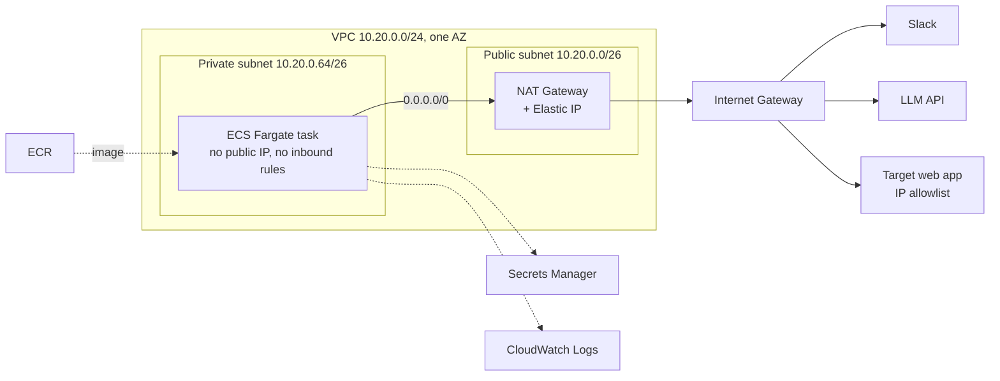

# AWS Deployment

This document is for the engineer who deploys the platform on AWS. It covers the infrastructure, the exact commands, the measurements from the verification run, operations, and the move of the LLM to Amazon Bedrock. What the platform is made of is in [02-platform-architecture.md](02-platform-architecture.md); why each AWS service was chosen and what it costs is in [01-platform-overview.md](01-platform-overview.md).

One deployment serves every POC: they run in the same process, in the same task. The commands below were written and run for the first POC, [web form automation](poc/01-web-form-automation.md). What the [daily report](poc/02-daily-report.md) adds is in section 5.

## 1. What was run and what was not

Each step below is labelled, because the document mixes steps that were run with steps written from the design.

| Part | Status |
|---|---|
| Web form automation | Run on AWS, in the two-container form with the mock portal |
| Daily report | **Not run on AWS.** Run from a laptop against a real Slack workspace and a real Jira Cloud site on 2026-10-06 |
| Image, secret, execution role, log group, two-container task definition, ECS service | **Run on AWS on 2026-10-05**: `ap-southeast-2`, `ARM64` image, zsh |
| Network in that run | Default VPC, public subnet, `assignPublicIp=ENABLED`. Not the target network |
| VPC, private subnet, NAT Gateway, Elastic IP (3.5, 3.7, and the network settings in 3.8) | **Not run.** Checked for syntax and zsh variable expansion only |
| Single-container task definition for the real web app (section 4) | **Not run** |
| Deploying a new version (7.1) | **Not run** |
| Cleanup (7.3) | **Run on 2026-10-05**, except the VPC, NAT and Elastic IP commands, since those resources never existed |
| Daily report settings in the task definition (section 5) | **Not run** |
| LLM through Amazon Bedrock (section 8) | **Not run.** Test calls were refused at account level |

The POC environment was deleted after the run.

## 2. Infrastructure



Every connection the task makes leaves through the NAT Gateway, including the image pull, the secret read and the log writes. Settings the overview does not cover:

| Setting | Reason |
|---|---|
| One AZ, one NAT Gateway | There is one task. A second AZ means a second NAT and **a second IP to register**, without real added availability. Sharing an AZ also avoids cross-AZ data charges |
| Task count 1, `minimumHealthyPercent=0`, `maximumPercent=100` | ECS stops the old task before starting the new one. Two copies would split Slack's events, and an approval could reach the copy that does not hold the job |
| Fargate 1 vCPU, 2 GB, `ARM64` | Must match the CPU architecture of the machine that built the image |
| Secrets injected as environment variables at task start | `EnvSecretStore` works unchanged. Only the execution role can read the secret |
| No task role | The application calls no AWS service at run time. One is needed for Bedrock (section 8) |
| No VPC endpoints | Each is billed hourly and costs more than the NAT traffic it saves. An image pull through NAT is about 950 MB, about 0.06 USD per task start |
| Site-to-Site VPN ruled out | Not available in projects of the new AWS experience |

## 3. Build steps

### 3.1 Prerequisites

- Permissions for ECR, ECS, IAM, Secrets Manager, CloudWatch Logs and EC2 networking.
- AWS CLI v2 signed in, and Docker running.
- The Slack app installed from `slack-app-manifest.yaml`, with both tokens at hand.
- **The local Slack app stopped.** Two processes on one app token split the events.

```bash
export AWS_REGION=ap-southeast-2              # change to your region
export AWS_PROFILE=slack-web-automation-poc   # only when signing in with a named profile
export APP=slack-web-automation-poc
export ACCOUNT_ID=$(aws sts get-caller-identity --query Account --output text)
export IMAGE=$ACCOUNT_ID.dkr.ecr.$AWS_REGION.amazonaws.com/$APP:v1
```

The braces in `${ACCOUNT_ID}:role`, `${SECRET_ARN}:NAME` and `${AWS_REGION}a` are deliberate. In zsh, `$VAR:r…` and `$VAR:P…` are read as modifiers and produce a broken ARN with no error.

### 3.2 Image (run)

```bash
aws ecr create-repository --repository-name $APP --region $AWS_REGION
aws ecr get-login-password --region $AWS_REGION \
  | docker login --username AWS --password-stdin $ACCOUNT_ID.dkr.ecr.$AWS_REGION.amazonaws.com
docker build -t $IMAGE .
docker push $IMAGE
```

### 3.3 Secret (run)

Write the values to a temporary file outside the repo, so they stay out of shell history, then delete it.

```bash
cat > /tmp/poc-secrets.json <<'JSON'
{
  "SLACK_BOT_TOKEN": "…",
  "SLACK_APP_TOKEN": "…",
  "OPENROUTER_API_KEY": "…",
  "PORTAL_USERNAME": "demo-operator",
  "PORTAL_PASSWORD": "…"
}
JSON

aws secretsmanager create-secret --name $APP --secret-string file:///tmp/poc-secrets.json --region $AWS_REGION
rm /tmp/poc-secrets.json
export SECRET_ARN=$(aws secretsmanager describe-secret --secret-id $APP --region $AWS_REGION --query ARN --output text)
```

To run without the LLM, leave out `OPENROUTER_API_KEY` here and in step 3.6.

### 3.4 Execution role and log group (run)

```bash
cat > /tmp/trust.json <<'JSON'
{ "Version": "2012-10-17", "Statement": [{ "Effect": "Allow", "Principal": { "Service": "ecs-tasks.amazonaws.com" }, "Action": "sts:AssumeRole" }] }
JSON

aws iam create-role --role-name $APP-execution --assume-role-policy-document file:///tmp/trust.json
aws iam attach-role-policy --role-name $APP-execution \
  --policy-arn arn:aws:iam::aws:policy/service-role/AmazonECSTaskExecutionRolePolicy
aws iam put-role-policy --role-name $APP-execution --policy-name read-secret --policy-document "{
  \"Version\": \"2012-10-17\",
  \"Statement\": [{ \"Effect\": \"Allow\", \"Action\": \"secretsmanager:GetSecretValue\", \"Resource\": \"$SECRET_ARN\" }]
}"

aws logs create-log-group --log-group-name /ecs/$APP --region $AWS_REGION
aws logs put-retention-policy --log-group-name /ecs/$APP --retention-in-days 7 --region $AWS_REGION
```

### 3.5 Network (not run)

Pick a CIDR range that does not overlap the organisation's internal networks.

```bash
export AZ=${AWS_REGION}a

# VPC and two subnets in the same AZ
export VPC_ID=$(aws ec2 create-vpc --cidr-block 10.20.0.0/24 \
  --tag-specifications "ResourceType=vpc,Tags=[{Key=Name,Value=$APP}]" \
  --query Vpc.VpcId --output text --region $AWS_REGION)
export PUBLIC_SUBNET_ID=$(aws ec2 create-subnet --vpc-id $VPC_ID --cidr-block 10.20.0.0/26 \
  --availability-zone $AZ --query Subnet.SubnetId --output text --region $AWS_REGION)
export PRIVATE_SUBNET_ID=$(aws ec2 create-subnet --vpc-id $VPC_ID --cidr-block 10.20.0.64/26 \
  --availability-zone $AZ --query Subnet.SubnetId --output text --region $AWS_REGION)

# Public subnet: route out through the internet gateway
export IGW_ID=$(aws ec2 create-internet-gateway --query InternetGateway.InternetGatewayId --output text --region $AWS_REGION)
aws ec2 attach-internet-gateway --internet-gateway-id $IGW_ID --vpc-id $VPC_ID --region $AWS_REGION
export PUBLIC_RT_ID=$(aws ec2 create-route-table --vpc-id $VPC_ID --query RouteTable.RouteTableId --output text --region $AWS_REGION)
aws ec2 create-route --route-table-id $PUBLIC_RT_ID --destination-cidr-block 0.0.0.0/0 --gateway-id $IGW_ID --region $AWS_REGION
aws ec2 associate-route-table --route-table-id $PUBLIC_RT_ID --subnet-id $PUBLIC_SUBNET_ID --region $AWS_REGION

# Elastic IP and NAT Gateway in the public subnet
export EIP_ALLOC_ID=$(aws ec2 allocate-address --domain vpc --query AllocationId --output text --region $AWS_REGION)
export EGRESS_IP=$(aws ec2 describe-addresses --allocation-ids $EIP_ALLOC_ID --query 'Addresses[0].PublicIp' --output text --region $AWS_REGION)
export NAT_ID=$(aws ec2 create-nat-gateway --subnet-id $PUBLIC_SUBNET_ID --allocation-id $EIP_ALLOC_ID \
  --query NatGateway.NatGatewayId --output text --region $AWS_REGION)
aws ec2 wait nat-gateway-available --nat-gateway-ids $NAT_ID --region $AWS_REGION

# Private subnet: route out through NAT
export PRIVATE_RT_ID=$(aws ec2 create-route-table --vpc-id $VPC_ID --query RouteTable.RouteTableId --output text --region $AWS_REGION)
aws ec2 create-route --route-table-id $PRIVATE_RT_ID --destination-cidr-block 0.0.0.0/0 --nat-gateway-id $NAT_ID --region $AWS_REGION
aws ec2 associate-route-table --route-table-id $PRIVATE_RT_ID --subnet-id $PRIVATE_SUBNET_ID --region $AWS_REGION

# Security group: no inbound rules, all outbound allowed by default
export SG_ID=$(aws ec2 create-security-group --group-name $APP --description "$APP: outbound only" \
  --vpc-id $VPC_ID --query GroupId --output text --region $AWS_REGION)

echo "Address to register with the web app owner: $EGRESS_IP"
```

`$EGRESS_IP` stays the same for as long as the Elastic IP is not released, even if the NAT Gateway is deleted and recreated with the same `$EIP_ALLOC_ID`. The NAT Gateway is billed from creation, including while no task runs.

### 3.6 Task definition (run, in this two-container form)

The two containers share `localhost`, so the mock portal runs beside the app. Use this form to verify the infrastructure before switching to the real web app. Set `TZ` to the users' time zone: "tomorrow" is computed in the container's clock, which defaults to UTC.

```bash
cat > /tmp/taskdef.json <<JSON
{
  "family": "$APP",
  "networkMode": "awsvpc",
  "requiresCompatibilities": ["FARGATE"],
  "cpu": "1024",
  "memory": "2048",
  "runtimePlatform": { "cpuArchitecture": "ARM64", "operatingSystemFamily": "LINUX" },
  "executionRoleArn": "arn:aws:iam::${ACCOUNT_ID}:role/$APP-execution",
  "containerDefinitions": [
    {
      "name": "portal",
      "image": "$IMAGE",
      "essential": true,
      "command": ["node", "src/mock-portal/start-mock-portal.js"],
      "environment": [{ "name": "MOCK_PORTAL_PORT", "value": "4010" }],
      "secrets": [
        { "name": "PORTAL_USERNAME", "valueFrom": "${SECRET_ARN}:PORTAL_USERNAME::" },
        { "name": "PORTAL_PASSWORD", "valueFrom": "${SECRET_ARN}:PORTAL_PASSWORD::" }
      ],
      "logConfiguration": { "logDriver": "awslogs", "options": { "awslogs-group": "/ecs/$APP", "awslogs-region": "$AWS_REGION", "awslogs-stream-prefix": "portal" } }
    },
    {
      "name": "slack-app",
      "image": "$IMAGE",
      "essential": true,
      "dependsOn": [{ "containerName": "portal", "condition": "START" }],
      "environment": [
        { "name": "PORTAL_BASE_URL", "value": "http://127.0.0.1:4010" },
        { "name": "TZ", "value": "Asia/Ho_Chi_Minh" }
      ],
      "secrets": [
        { "name": "SLACK_BOT_TOKEN", "valueFrom": "${SECRET_ARN}:SLACK_BOT_TOKEN::" },
        { "name": "SLACK_APP_TOKEN", "valueFrom": "${SECRET_ARN}:SLACK_APP_TOKEN::" },
        { "name": "OPENROUTER_API_KEY", "valueFrom": "${SECRET_ARN}:OPENROUTER_API_KEY::" },
        { "name": "PORTAL_USERNAME", "valueFrom": "${SECRET_ARN}:PORTAL_USERNAME::" },
        { "name": "PORTAL_PASSWORD", "valueFrom": "${SECRET_ARN}:PORTAL_PASSWORD::" }
      ],
      "logConfiguration": { "logDriver": "awslogs", "options": { "awslogs-group": "/ecs/$APP", "awslogs-region": "$AWS_REGION", "awslogs-stream-prefix": "slack" } }
    }
  ]
}
JSON

aws ecs register-task-definition --cli-input-json file:///tmp/taskdef.json --region $AWS_REGION
aws ecs create-cluster --cluster-name $APP --region $AWS_REGION
```

If this returns `ClientException: Role is not valid`, look at the ARNs in `/tmp/taskdef.json`. In the verification run the cause was zsh mangling them (step 3.1), not IAM.

### 3.7 Confirm the outbound IP (not run)

Do this before giving the address to the web app's owner. Run a one-off task in the private subnet whose command prints its own public IP:

```bash
aws ecs run-task --cluster $APP --task-definition $APP --launch-type FARGATE \
  --network-configuration "awsvpcConfiguration={subnets=[$PRIVATE_SUBNET_ID],securityGroups=[$SG_ID],assignPublicIp=DISABLED}" \
  --overrides '{"containerOverrides":[{"name":"slack-app","command":["node","-e","fetch(\"https://checkip.amazonaws.com\").then(r=>r.text()).then(console.log)"]}]}' \
  --region $AWS_REGION

# wait about a minute
aws logs tail /ecs/$APP --log-stream-name-prefix slack --since 5m --region $AWS_REGION
echo $EGRESS_IP
```

It passes when the address in the log equals `$EGRESS_IP`. A pass also proves the private subnet can pull the image, read the secret and write logs through NAT. If the task stops with an image pull or secret error, check the private subnet's `0.0.0.0/0` route and the NAT Gateway's state.

### 3.8 Service (run with a public subnet; these network settings not run)

```bash
aws ecs create-service --cluster $APP --service-name $APP --task-definition $APP \
  --desired-count 1 --launch-type FARGATE \
  --deployment-configuration minimumHealthyPercent=0,maximumPercent=100 \
  --network-configuration "awsvpcConfiguration={subnets=[$PRIVATE_SUBNET_ID],securityGroups=[$SG_ID],assignPublicIp=DISABLED}" \
  --region $AWS_REGION
```

### 3.9 Check

```bash
aws ecs describe-services --cluster $APP --services $APP --region $AWS_REGION \
  --query 'services[0].{running:runningCount,events:events[0:3].message}'
aws logs tail /ecs/$APP --since 10m --region $AWS_REGION
```

Expect `Mock portal listening on http://127.0.0.1:4010` and `"event":"slack_app_started"` with `"llmPrefill":true`. Then send requests from Slack, using the sentences in `test/fixtures/free-text-requests.js`:

| Action | Log events |
|---|---|
| Approve | `job_started`, `job_awaiting_approval`, `approval_requested`, `job_submitted` with a reference number |
| Cancel | `job_cancelled` |
| Edit, then save | `job_cancelled` for the old session, then `job_started` with a new `jobId` |
| The website rejects the form | `job_failed` and `prepare_failed`, with `code` set to `form_rejected` and the website's message word for word |

Validation errors in the Slack form create no job and leave no log line.

## 4. Switching the web form POC to the real web app (not run)

Suggested order: build the network, confirm the IP (3.7), run with the mock portal (3.8, 3.9), then switch. That keeps infrastructure faults apart from worker faults. The code changes are in [poc/01-web-form-automation.md](poc/01-web-form-automation.md), section 6.

Put the real account into the secret, then register a task definition that differs from 3.6 in three ways: remove the `portal` container, remove `dependsOn` from `slack-app`, and set `PORTAL_BASE_URL` to the real address.

```bash
aws secretsmanager put-secret-value --secret-id $APP --secret-string file:///tmp/poc-secrets.json --region $AWS_REGION
rm /tmp/poc-secrets.json

# after editing /tmp/taskdef.json
aws ecs register-task-definition --cli-input-json file:///tmp/taskdef.json --region $AWS_REGION
aws ecs update-service --cluster $APP --service $APP --task-definition $APP --region $AWS_REGION
```

Secrets are read only when a task starts. After changing a secret value alone, add `--force-new-deployment` to `update-service`.

## 5. Adding the daily report (not run)

The daily report needs no new AWS resource. It runs inside the `slack-app` container and makes three kinds of outbound HTTPS calls: Slack, Jira Cloud and the LLM. None of them restricts the caller's IP address, so the report works with or without the NAT Gateway.

Add two keys to the secret (step 3.3), and in the `slack-app` container definition (step 3.6) add them under `secrets` and the rest under `environment`:

| Name | Where | Value |
|---|---|---|
| `JIRA_EMAIL` | secret | The Atlassian account the report reads Jira with |
| `JIRA_API_TOKEN` | secret | An API token of that account |
| `JIRA_BASE_URL` | environment | `https://<site>.atlassian.net` |
| `JIRA_PROJECT_KEY` or `JIRA_JQL` | environment | The project, or a full query |
| `REPORT_CHANNELS` | environment | Channel IDs to read, comma-separated |
| `REPORT_POST_CHANNEL` | environment | Channel ID the report is posted to |
| `REPORT_TIME` | environment | Local `HH:MM` to post every day; leave out to post only on `/daily-report` |
| `TZ` | environment | Already set in 3.6. The day window and `REPORT_TIME` both use the container's clock |

Then register the task definition and update the service as in section 4. Before that, update the Slack app from `slack-app-manifest.yaml` and reinstall it: the report needs scopes the first POC did not.

The schedule lives in the process. A task that is stopped at `REPORT_TIME` posts nothing for that day, and nothing catches up afterwards. For a schedule that survives restarts, an EventBridge Scheduler rule that starts a one-off task running `node scripts/run-daily-report.js --post` is the AWS-native form; it has not been built.

## 6. Measurements, 2026-10-05

Web form automation in the two-container form, public subnet, 5 requests sent one after another over about three minutes. The daily report has not been measured on AWS.

| Check | Result |
|---|---|
| Time to `job_awaiting_approval` | About 1 second |
| Time to `approval_requested` (screenshot in Slack) | About 3 seconds |
| Task start to Slack connected | About 40 seconds |
| Peak memory and CPU, one-minute data | 9.9% of 2 GB, 7.2% of 1 vCPU |
| Time zone | "tomorrow" sent at 23:29 on 5 October, Vietnam time, produced a reference dated 6 October |
| Secrets in the log | None for the prefixes `xoxb-`, `xapp-`, `sk-or-`. The website password was not searched for |

Latency was measured with the mock portal on `localhost`. Against a real web app it will depend mostly on that web app.

Not tried: recovery after `aws ecs stop-task`, expiry after 10 minutes, two requests awaiting approval at once, and the fixed outbound IP. The task size was left at 2 GB because nothing was measured with several browsers open.

## 7. Operations

### 7.1 Deploying a new version (not run)

Build and push the image under a new tag, recreate `/tmp/taskdef.json` with it, then run `register-task-definition` and `update-service` as in section 4. Deploy only when no request is awaiting approval: the old task stops first and pending requests are lost.

### 7.2 Pausing

```bash
aws ecs update-service --cluster $APP --service $APP --desired-count 0 --region $AWS_REGION
```

This stops the Fargate charge only. To also stop the NAT charge and keep the registered address: delete the NAT Gateway, keep the Elastic IP, and later create a new NAT with the same `$EIP_ALLOC_ID` and recreate the private subnet's `0.0.0.0/0` route.

### 7.3 Cleanup (run on 2026-10-05, except the network commands)

The NAT Gateway must be fully deleted before the Elastic IP can be released. **Releasing the Elastic IP gives up the registered address for good.**

```bash
aws ecs update-service --cluster $APP --service $APP --desired-count 0 --region $AWS_REGION
aws ecs delete-service --cluster $APP --service $APP --force --region $AWS_REGION
aws ecs delete-cluster --cluster $APP --region $AWS_REGION
aws ecs deregister-task-definition --task-definition $APP:1 --region $AWS_REGION   # repeat for each revision

# not run: the POC had no NAT Gateway or Elastic IP
aws ec2 delete-nat-gateway --nat-gateway-id $NAT_ID --region $AWS_REGION
aws ec2 wait nat-gateway-deleted --nat-gateway-ids $NAT_ID --region $AWS_REGION
aws ec2 release-address --allocation-id $EIP_ALLOC_ID --region $AWS_REGION

aws ec2 delete-security-group --group-id $SG_ID --region $AWS_REGION

# not run: the POC used the default VPC
aws ec2 delete-subnet --subnet-id $PRIVATE_SUBNET_ID --region $AWS_REGION
aws ec2 delete-subnet --subnet-id $PUBLIC_SUBNET_ID --region $AWS_REGION
aws ec2 delete-route-table --route-table-id $PRIVATE_RT_ID --region $AWS_REGION
aws ec2 delete-route-table --route-table-id $PUBLIC_RT_ID --region $AWS_REGION
aws ec2 detach-internet-gateway --internet-gateway-id $IGW_ID --vpc-id $VPC_ID --region $AWS_REGION
aws ec2 delete-internet-gateway --internet-gateway-id $IGW_ID --region $AWS_REGION
aws ec2 delete-vpc --vpc-id $VPC_ID --region $AWS_REGION

aws logs delete-log-group --log-group-name /ecs/$APP --region $AWS_REGION
aws secretsmanager delete-secret --secret-id $APP --force-delete-without-recovery --region $AWS_REGION
aws iam delete-role-policy --role-name $APP-execution --policy-name read-secret
aws iam detach-role-policy --role-name $APP-execution --policy-arn arn:aws:iam::aws:policy/service-role/AmazonECSTaskExecutionRolePolicy
aws iam delete-role --role-name $APP-execution
aws ecr delete-repository --repository-name $APP --force --region $AWS_REGION
```

- The security group returned `DependencyViolation` for about a minute after the service was deleted, until the task's network interface was released. Retry every ten seconds.
- `--force-delete-without-recovery` removes the secret at once. Keep the values elsewhere first if they are still needed.
- Afterwards, ask the web app's owner to remove the address from the allowlist.

## 8. Moving the LLM to Amazon Bedrock

Every LLM call in the platform goes through one function, `chatCompletion` in `src/llm/openrouter-chat.js`, which calls OpenRouter with the default model `deepseek/deepseek-v4.1-flash`. Two jobs use it:

| Job | Input | Output |
|---|---|---|
| Web form pre-fill | One short sentence | A JSON object of about fifteen fields |
| Daily report | One day of chat and the issue list, capped at 120,000 characters of chat | A report of eight sections |

**Status: not run.** Bedrock refused every test call on both AWS accounts that were tried. Per [AWS's guidance](https://repost.aws/knowledge-center/bedrock-invokemodel-api-error) this is an account-level restriction that IAM cannot fix and needs AWS Support. The models' quality on either job is therefore unmeasured.

| Account | Date | Result of `Converse` |
|---|---|---|
| Project of the new AWS experience, free plan, `ap-southeast-2` | 2026-10-05 | Five models: `ValidationException: Operation not allowed` |
| The same project after the upgrade to the paid plan | 2026-10-06 | Four models: the same error |
| A standard AWS account, in `ap-northeast-1`, `us-east-1` and `ap-southeast-2` | 2026-10-06 | `ValidationException: Error 002: Access to Bedrock models is not allowed for this account` |

| Model | ID | Input / output, USD per 1,000 tokens | Notes |
|---|---|---|---|
| Amazon Nova Lite (proposed start) | `amazon.nova-lite-v1:0` | 0.000063 / 0.000252 | In-region, on demand |
| Amazon Nova Micro | `amazon.nova-micro-v1:0` | 0.000037 / 0.000148 | Try it if Lite passes comfortably |
| Claude Haiku 4.5 | `au.anthropic.claude-haiku-4-5-20251001-v1:0` | not fetched | Cross-Region inference profile only, which projects of the new AWS experience do not support; needs a standard AWS account |

The acceptance test is the 11 model tests in `npm test`: ten sentences for the pre-fill and one sample day for the report. The default OpenRouter model passes all of them. The report is the harder job, so a model that passes the pre-fill tests may still need to be a size up for the report; `REPORT_MODEL` sets the two apart.

**Integration with a task role (proposed).** No key to store or rotate.

1. In `src/llm/openrouter-chat.js`, replace the `fetch` call with `ConverseCommand` from `@aws-sdk/client-bedrock-runtime`, keeping the function's inputs and its plain-text result. The prompts and the two callers stay as they are.
2. In `src/config.js`, `src/slack/start-slack-app.js` and `src/report/configured-reporter.js`, enable the LLM when a model ID is set, for example `BEDROCK_MODEL_ID`, in place of `OPENROUTER_API_KEY`.
3. Add a task role, then add `"taskRoleArn": "arn:aws:iam::${ACCOUNT_ID}:role/$APP-task"` and the `BEDROCK_MODEL_ID` variable to the task definition, and remove `OPENROUTER_API_KEY` from it and from the secret.

```bash
export MODEL_ID=amazon.nova-lite-v1:0

aws iam create-role --role-name $APP-task --assume-role-policy-document file:///tmp/trust.json
aws iam put-role-policy --role-name $APP-task --policy-name invoke-model --policy-document "{
  \"Version\": \"2012-10-17\",
  \"Statement\": [{ \"Effect\": \"Allow\", \"Action\": \"bedrock:InvokeModel\", \"Resource\": \"arn:aws:bedrock:${AWS_REGION}::foundation-model/$MODEL_ID\" }]
}"
```

Calls to Bedrock go through NAT like everything else. If policy requires the traffic to stay off the internet, add an interface VPC endpoint for `com.amazonaws.<region>.bedrock-runtime`.

**Alternative with the least code change.** Bedrock has an OpenAI-compatible endpoint, `https://bedrock-runtime.<region>.amazonaws.com/openai/v1/chat/completions`, used with a Bedrock API key as the bearer token. Only the endpoint in `openrouter-chat.js` and the model ID change, but a key still has to be stored and rotated, and not every model is served this way. See [Chat Completions API](https://docs.aws.amazon.com/bedrock/latest/userguide/inference-chat-completions.html).
