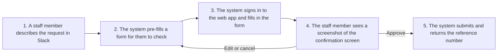
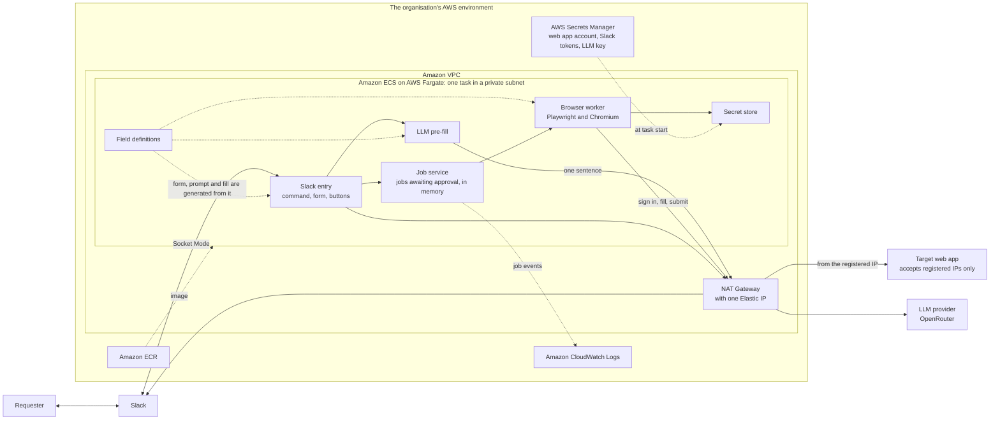
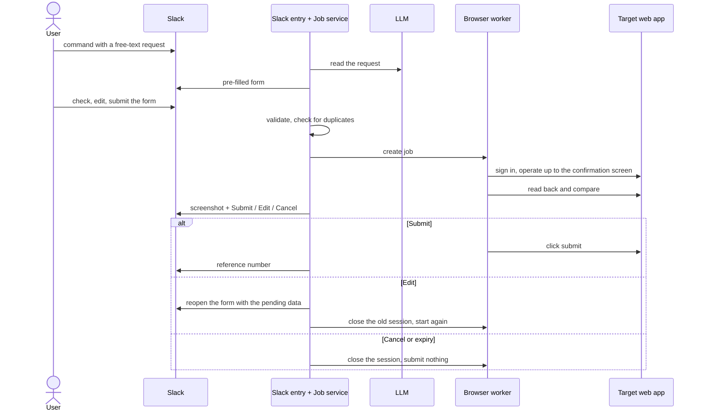
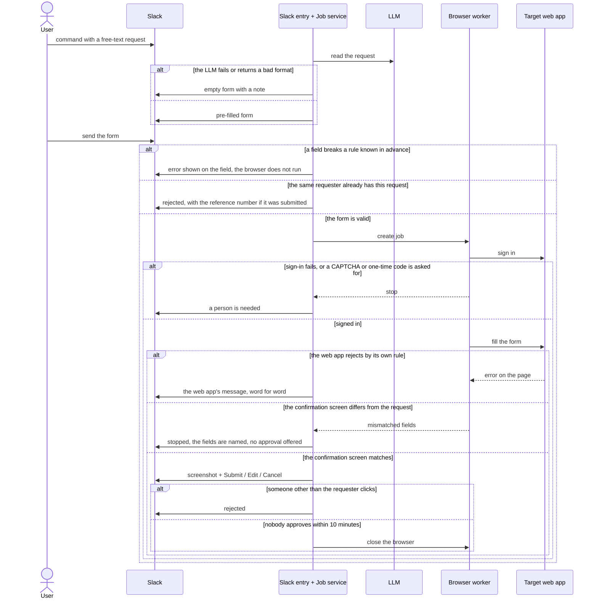
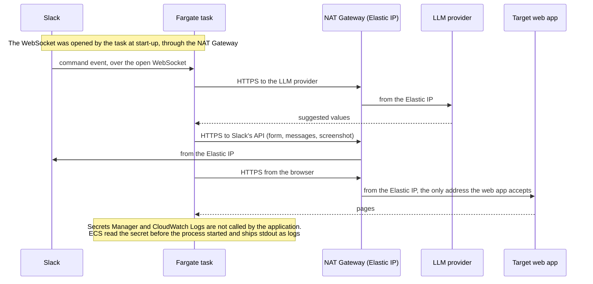

# POC 1: Web Form Automation

A staff member asks in Slack with one sentence. The system signs in to a web application that has no API, fills in the form, stops at the confirmation screen, and submits only when the person who asked approves it.

This document covers what is specific to this POC. The shared parts (Slack connection, LLM client, configuration, rules every POC keeps) are in [02-platform-architecture.md](../02-platform-architecture.md); the AWS setup is in [03-aws-deployment.md](../03-aws-deployment.md); the summary for decision makers is in [01-platform-overview.md](../01-platform-overview.md).

The example in the repository is a three-step visitor registration form on a simulated website, the mock portal.

## 1. Status

| Part | Status |
|---|---|
| Full flow: Slack, LLM pre-fill, browser, approval, duplicate check | Verified locally with automated tests that drive a real browser |
| The same flow on AWS | Run on 2026-10-05 with 5 requests from Slack, in a public subnet. The environment was then deleted |
| Fixed outbound IP address | **Not run** |
| Real web application, single sign-on, CAPTCHA | **Not verified.** Only the mock portal has been used |
| Several requests waiting at once, recovery after a restart, expiry after 10 minutes on AWS | **Not tried** |

## 2. Problem and constraint

A group of staff repeat one task on a web application many times a day: sign in, fill in a multi-step form, check it, submit. The web application has no usable API. Submitting cannot be undone: a wrong submission is a wrong record in someone else's system.

One constraint decides the infrastructure: **the web application accepts connections only from registered IP addresses.** Every outbound connection has to leave from one fixed address, which is why this POC, and only this POC, needs the NAT Gateway described in the deployment document.

The approach fits when:

- The task has repeatable steps and well-structured input.
- The web application has no usable API. Where an API exists, calling it is cheaper and lasts longer than driving a browser.
- The web application's owner allows automated use through an issued account, and will register an IP address.
- A delay of a few seconds to a few tens of seconds per request is acceptable.

It does not fit when:

- The web application blocks automation with a CAPTCHA, or asks for a one-time code at every sign-in.
- Its terms of use forbid automated access.
- Its screens change often without notice, and nobody owns the maintenance of the script.
- The volume is large enough to need batch processing.

Other ways to approach the problem:

| Option | Why not here |
|---|---|
| Ask the web application's owner for an API | The best answer where it exists. This POC is for when it does not |
| A commercial RPA tool | Strong for processes on personal computers. For one web task it adds licence fees and a platform to run |
| Let an LLM drive the browser on its own | Flexible, but slow, costly, and not guaranteed to do the same thing every time. For a structured, repeated task a fixed script is more dependable |

## 3. How it works

### 3.1 Components

AWS services in this POC: ECS on Fargate, ECR, Secrets Manager, CloudWatch Logs and an IAM execution role, all run on 2026-10-05; and a VPC with a NAT Gateway and an Elastic IP, which this POC requires for the registered IP address and which has **not been run**. In the trial the mock portal ran as a second container in the same task, in place of the target web app.

| Component | Responsibility | In the repo |
|---|---|---|
| Slack entry | Receives `/visitor`, opens the form, returns per-field errors, sends the screenshot and the approval buttons | `src/slack/slack-handlers.js`, `src/slack/registration-modal.js` |
| Field definitions | Fields, input types, normalisation, validation rules, display | `src/core/registration-fields.js` |
| LLM pre-fill | Turns a free-text request into suggested values; drops malformed values | `src/llm/parse-free-text-request.js` |
| Job service | Lifecycle of one request: validation, duplicate check, the session awaiting approval, expiry, who may approve | `src/core/registration-service.js` |
| Browser worker | Signs in, operates the site, compares the confirmation screen, submits once approved | `src/worker/portal-browser-session.js` |
| Secret store | Sign-in credentials for the web application; the source can change without touching the worker | `src/core/secret-store.js` |
| Target web application | In the POC, a simulated website | `src/mock-portal/` |

### 3.2 Sequences

**Main flow**, with the three ways a waiting request ends:

**Stops and rejections.** Every branch ends with nothing submitted:

**Where the traffic goes on AWS.** One request, seen from the network:

The browser stays open on the confirmation screen while the job waits for approval. What the user sees in the screenshot is exactly what gets submitted; no second fill happens in between. The consequence: job state lives in the memory of one process, and the platform must run exactly one copy of it.

## 4. Design rules of this POC

These add to the rules every POC keeps (architecture document, section 5).

| Rule | What it means | Why |
|---|---|---|
| The requester approves the exact screen | Automation stops at the confirmation screen. Only the person who asked can approve, edit or cancel | A mistake while filling can be fixed; a mistake after submitting cannot |
| The LLM only pre-fills | What reaches the web application is what the user reviewed in the Slack form | LLM output is not stable enough to create a transaction |
| One definition of the data | The Slack form, the LLM prompt and the browser fill are all generated from `registration-fields.js` | Adding a field means changing one place |
| Validate early, then validate again | Rules known in advance are checked in Slack. Rules only the web application knows are read from its error message and passed on word for word | The user gets the error on the right field without waiting for the browser |
| Read back before trusting | After filling, the worker reads the confirmation screen and compares it with the requested data | Catches wrong fills, drifted selectors and values the web application changed by itself |
| Never submit twice | Each request has a key built from the requester and the content; duplicates are rejected | Slack can redeliver events, and users can click twice |
| Details go by direct message | The screenshot and the result go to the requester; the shared channel gets one line saying the request was received | The shared channel includes people who are not involved |

## 5. Error handling

| Situation | Behaviour |
|---|---|
| Data breaks a rule known in advance | The Slack form shows the error on the field; the browser does not run |
| The web application rejects by its own rule | The worker reads the error on the page; Slack shows it word for word |
| The confirmation screen differs from the requested data | Stop, name the mismatched fields, do not allow approval |
| Sign-in fails | Stop and report; the password does not appear in the log |
| The web application asks for a CAPTCHA or a one-time code | Stop and report that a person is needed |
| Duplicate request | Reject, with the reference number if it was already submitted |
| Someone else clicks approve, edit or cancel | Reject |
| Nobody approves within `APPROVAL_TTL_SECONDS` (default 10 minutes) | Close the browser, submit nothing |
| Edit after the original was submitted or cancelled | Do not apply the change and do not create a second request |
| The LLM cannot read the request or returns a bad format | The form opens empty with a note, and the user fills it in |

## 6. Switching to the real web application (not run)

The AWS side of the switch is in [03-aws-deployment.md](../03-aws-deployment.md), section 4.

### 6.1 Work outside the code

- Written approval from the web application's owner for automated access.
- A dedicated automation account with minimum permissions, exempt from CAPTCHA and one-time codes. Everything done on the web application will be recorded under this account, so the platform's log has to say who in Slack made each request.
- The owner registers the platform's outbound IP address.

### 6.2 Work in the code

The framework stays; three places are rewritten:

1. **Field definitions** (`src/core/registration-fields.js`). Declare the fields, input types and rules of the new task. The Slack form and the LLM prompt follow from them.
2. **Browser worker** (`src/worker/`). Rewrite the sign-in, the steps, the confirmation-screen read and the submit. Keep the boundary: one function that goes as far as the stopping point (`fillToConfirmation`), and a separate one for the irreversible step (`submit`).
3. **Command name and Slack wording** (`src/slack/`, `slack-app-manifest.yaml`).

If the task has no confirmation screen of its own, create the stopping point: stop before the last button, take a screenshot and read back the fields that were filled.

Advice on the browser script:

- Prefer what a user sees (label, role, button name) over CSS classes and page structure. They change less often.
- Wait on page state (an element appears, the options have loaded), not on fixed delays.
- Always read back. When the screen changes, this turns a silent fault into a reported one.
- Run a test request on a schedule, up to the stopping point, then cancel it, to learn early when the web application changes.

A second web application means a second set of these three parts. The repository holds one today, and nothing in it yet selects between several.

## 7. What was verified

On AWS, 2026-10-05, 5 requests from Slack to the mock portal:

| Question | Result |
|---|---|
| How long does a staff member wait? | About 3 seconds from sending the form to receiving the confirmation screenshot |
| Was anything submitted without approval? | No. The two approved requests received reference numbers; the two cancelled requests submitted nothing |
| What happens when the web application rejects a request? | The staff member received the web application's own error message |
| Does it use much capacity? | Peak use was about 10% of the 2 GB allocated |

The full measurements are in [03-aws-deployment.md](../03-aws-deployment.md), section 6. Latency was measured with the mock portal in the same task; against a real web application it will depend mostly on that application.

Locally, `npm test` covers the field rules, the browser flow against the mock portal, the Slack flow with a fake Slack client, and ten free-text requests in English, Vietnamese and Japanese read by the real model.

## 8. Risks and gaps to production

Risks specific to this POC:

| Risk | Impact | How it is handled |
|---|---|---|
| The web application changes its screens | The system stops filling in the form until an engineer updates the script | The read-back turns a changed screen into a clear error and not a wrong submission. Someone must own the maintenance |
| The web application asks for a CAPTCHA or a one-time code | The system stops and reports that a person is needed | Agree with the owner on a dedicated account that skips these steps |
| The web application's terms forbid automated access | Legal risk and a locked account | Written approval before running against the real web application |
| Personal data in screenshots and request text | Compliance responsibility | Rules for where it is stored, how long it is kept and who may see it |
| Other workloads share the fixed IP address | Anything in the same private subnet reaches the web application from the registered address | Keep that network for this system alone |

Work needed for a production version, beyond the platform's own list (architecture document, section 8):

| Area | Now | Needed |
|---|---|---|
| Job state | In the memory of one process; a restart loses requests waiting for approval | Durable state; a waiting job stores data and does not hold a browser |
| Browser during approval | Each waiting job holds a browser | A limit on waiting jobs; or close the browser and fill again on approval, with a read-back |
| Audit | JSON log | A record of who asked, who approved, when, and the reference number |
| Monitoring | None | A scheduled test request that stops before submitting |
| Sign-in session | Signs in again for every job | Reuse the session where the web application allows it, to reduce load and the risk of a locked account |
| Image | Playwright base image with three browsers | Chromium only, to cut size and pull time |
