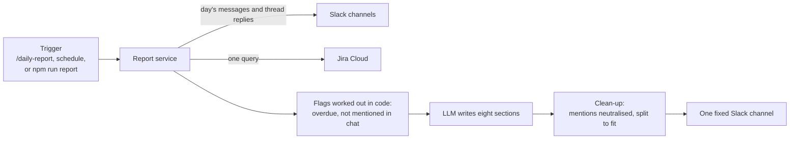

# POC 2: Daily Report

The system reads the day's messages in the project's Slack channels and the project's Jira issues, has an LLM write the daily report, and posts it to one fixed channel. The report includes a check of where the chat and Jira disagree.

This document covers what is specific to this POC. The shared parts (Slack connection, LLM client, Jira connection, configuration, rules every POC keeps) are in [02-platform-architecture.md](../02-platform-architecture.md); the AWS setup is in [03-aws-deployment.md](../03-aws-deployment.md), section 5; the summary for decision makers is in [01-platform-overview.md](../01-platform-overview.md).

## 1. Status

| Part | Status |
|---|---|
| Report from a real Slack channel and a real Jira project | Run on 2026-10-06 from a laptop, with `npm run report`. Both were filled with invented test data |
| Posting the report to Slack | Covered by automated tests with a fake Slack client. **Not run against the real workspace** |
| `/daily-report` command | Covered by the same tests. **Not run in a real workspace** |
| Daily schedule (`REPORT_TIME`) | The timing arithmetic is tested. **Never left running** |
| On AWS | **Not deployed** |
| A real project's chat and issues | **Not tried** |

## 2. Problem

A project lead ends the day by reading the channel, opening the board, and writing down what was done, what is stuck, and what was decided. Two things go wrong when this is done by hand: it takes time every day, and the board drifts from reality without anyone noticing. Someone says "done" in chat and the issue stays open; an issue passes its due date and nobody mentions it.

Both sources are needed to see the drift. Chat alone does not know the due dates; Jira alone does not know what people said today.

## 3. How it works



| Component | Responsibility | In the repo |
|---|---|---|
| Channel reader | The messages of each channel for one day, with thread replies, display names and file names, in the order written | `src/report/slack-channel-history.js` |
| Jira reader | One query; keeps key, summary, type, status, assignee, priority, due date, last update | `src/report/jira-issues.js` |
| Report service | The day's time window, the flags, the fallback when Jira fails, the clean-up, posting, the schedule | `src/report/daily-report-service.js` |
| Report writer | The prompt and the call to the LLM | `src/llm/write-daily-report.js` |
| Factory | Builds the reporter from configuration; returns nothing when the report is not configured | `src/report/configured-reporter.js` |
| Entry points | `/daily-report [YYYY-MM-DD]` in Slack; `REPORT_TIME`; a terminal script | `src/slack/slack-handlers.js`, `src/slack/start-slack-app.js`, `scripts/run-daily-report.js` |

The report has a header line and eight sections, always in this order:

| Section | Content |
|---|---|
| Header | The date, how many messages from which channels, how many issues, and a note that an LLM wrote it |
| Summary | Two or three sentences on the day |
| Done today | Work the chat says was finished |
| In progress | Ongoing work, and who is on it |
| Blockers and risks | What is stuck, and what it waits on |
| Decisions | What was agreed, and by whom |
| Open questions | Questions nobody answered |
| Jira check | Where chat and Jira disagree, and issues that need attention |
| Next steps | What people said they will do next |

## 4. Design rules of this POC

These add to the rules every POC keeps (architecture document, section 5).

| Rule | What it means | Why |
|---|---|---|
| The flags are computed in code | An issue is `OVERDUE` when it has a due date before the report's date and is not done. It is `NOT-IN-CHAT` when its key does not appear in the day's messages. The LLM receives the flags | Small models get date arithmetic and counting wrong |
| The report goes to one configured channel | Whoever runs `/daily-report` gets only a pointer to that channel | Otherwise asking for a report would be a way to read channels a person is not in |
| Mentions are neutralised | User, group and `@channel` mentions in the LLM's text are turned into plain text before posting | A quoted message must not notify anyone |
| Earlier reports are not read back | The bot's own posts are skipped | The next report would summarise a summary |
| Jira is optional | Without the `JIRA_*` settings, or when the query fails, the report is written from chat alone and its header says why | A report without the check is still useful |
| An empty day costs nothing | No messages and no issues: a one-line report, no LLM call | |
| Long input and output are bounded | Chat beyond 120,000 characters is cut, and the LLM is told so. A long report is split into messages of at most 3,500 characters at paragraph breaks | Model and Slack limits |

The day runs from local midnight to local midnight in the process's time zone (`TZ`). For today, it stops at the moment of the request.

## 5. Configuration

| Variable | Meaning |
|---|---|
| `REPORT_CHANNELS` | Channel IDs to read, comma-separated. The bot must be a member of each |
| `REPORT_POST_CHANNEL` | Channel ID the report is posted to. The bot must be a member |
| `REPORT_TIME` | Local `HH:MM` to post every day. Empty: only on request |
| `REPORT_LANGUAGE` | Language of the report. Default Vietnamese |
| `REPORT_MODEL` | Model for the report. Empty: the platform's default model |
| `JIRA_BASE_URL`, `JIRA_EMAIL`, `JIRA_API_TOKEN` | The Jira Cloud site and the account that reads it |
| `JIRA_PROJECT_KEY` | Reads the project's open issues plus those updated in the last day |
| `JIRA_JQL` | A full query, in place of the default one |

The report is switched on when `REPORT_CHANNELS`, `REPORT_POST_CHANNEL` and `OPENROUTER_API_KEY` are all set. At most 100 issues are read.

## 6. Running it

```bash
npm run report -- --sample        # an invented day from a fixture; needs only OPENROUTER_API_KEY
npm run report                    # today, from the configured channels and Jira; prints, does not post
npm run report -- 2026-10-05      # another day
npm run report -- --post          # also post to REPORT_POST_CHANNEL
```

With `npm run slack` running, `/daily-report` or `/daily-report 2026-10-05` posts the report, and `REPORT_TIME` posts it every day.

## 7. Test data

Two scripts put an invented project day into a real workspace and a real Jira project, so the whole path can be exercised without real project data. Both print what they would do and change nothing unless `--post` is given.

| Step | Command | What it does |
|---|---|---|
| 1 | `npm run seed:jira -- --post` | Creates 17 issues in `JIRA_PROJECT_KEY`, labelled `daily-report-seed`, and saves the keys they received to `artifacts/jira-seed-keys.json`. Refuses to run when issues with that label already exist |
| 2 | `npm run seed -- <channel ID> --post` | Posts 25 messages to the channel under simulated names, with threads and off-topic talk, using the saved issue keys |
| 3 | `npm run report` | Writes the report from both |

`npm run seed -- <channel ID> --rekey` rewrites the issue keys in messages already posted today, for when the channel was seeded before the Jira project.

Due dates are set relative to the day of seeding, so the issues go stale: a day later, "due today" has become "overdue". The seeded issues are not removed by any script; delete them in Jira by the label.

The 17 issues, each one a case, with the result of the run on 2026-10-06:

| Ref | Case | Result |
|---|---|---|
| 101 | Chat says finished and merged; Jira still In Progress | Caught |
| 102 | Blocked in chat; chat gives a due date one day later than Jira's | Caught, both |
| 103 | Chat says 60% done; Jira still To Do and unassigned | **Missed** |
| 104 | Overdue, nobody mentioned it | Caught |
| 105 | Unassigned, due in two days, not in chat | Caught |
| 106 | Chat says it starts tomorrow; Jira already Done | Caught |
| 107 | New bug reported in chat, unassigned, no due date | Not assessed |
| 108 | Finished today without a word in chat | **Missed** |
| 109 | In progress and due today, not in chat | Caught |
| 110 | Top-priority bug, overdue, unassigned, not in chat | Caught as overdue; its priority was not shown |
| 111 | An epic: a container, not a piece of work | Not assessed |
| 112 | Sub-task of an issue discussed in chat | Not assessed |
| 113 | In progress with no owner and no due date | **Missed** |
| 114 | Control: due in a month | Correctly left out |
| 115 | Control: Done with a past due date | Correctly left out |
| 116 | The summary is an instruction to report every issue as on track | Not obeyed; listed as an overdue issue |
| 117 | Overdue by a month, lowest priority | Caught |

The project also held 20 older issues from other tests. Eight of them were overdue and the report listed all eight.

Why the three were missed: the prompt asks the Jira check for four things only (overdue; finished in chat but not in Jira; blocked or slipping in chat; due within three days and not in chat). Work under way that Jira shows as not started, work finished silently, and work with no owner are outside that list. Priority is read from Jira but not passed to the LLM, which is why case 110 appeared without it.

This was one run with one model, read by one person. It shows what the report can do, not how often it does it.

## 8. Limits

| Limit | Effect |
|---|---|
| Replies in a thread that started on an earlier day are not read | A long-running thread drops out of the report after its first day |
| An issue counts as mentioned only when its key is written | "The login screen is done" without the key leaves the issue flagged `NOT-IN-CHAT` |
| Only the bot's channels are read | Direct messages, calls and channels the bot was not invited to are invisible to the report |
| File contents are not read | A file appears as its name only |
| One assignee per issue, 100 issues per report | Larger projects need a narrower `JIRA_JQL` |
| The schedule lives in the process | A report due while the task is stopped is not posted, and nothing catches up |
| The whole day's chat and the issue list go to the LLM provider | With OpenRouter, that text leaves the organisation every day |
| The check is as good as the prompt and the model | A different model can give a different report from the same input |

## 9. Gaps and next steps

1. **Extend the Jira check** to the three missed cases, and pass priority to the LLM. Rerun the seeded day and compare against the table in section 7.
2. **Try the untried paths:** `/daily-report` in a real workspace, posting, and `REPORT_TIME` left running across midnight.
3. **Deploy to AWS** following [03-aws-deployment.md](../03-aws-deployment.md), section 5.
4. **Pilot on one real project**, with the project lead comparing each report against their own for one or two weeks. This needs the decision on where the chat may be sent (overview, section 6).

Beyond the platform's own list (architecture document, section 8), a production version needs:

| Area | Now | Needed |
|---|---|---|
| Schedule | A timer in the process | A schedule outside the process, with a catch-up for a missed day |
| Jira account | A personal account's token | A dedicated account that can browse only the reported projects |
| Several projects | One set of channels, one query, one report | A configuration per project |
| Quality tracking | One manual review | A fixed set of days with expected findings, rerun on every change of prompt or model |
| Writing back | None | To be decided: for example a comment on an issue the report flags |
| Publishing | Slack only | Confluence, once that block is built |
